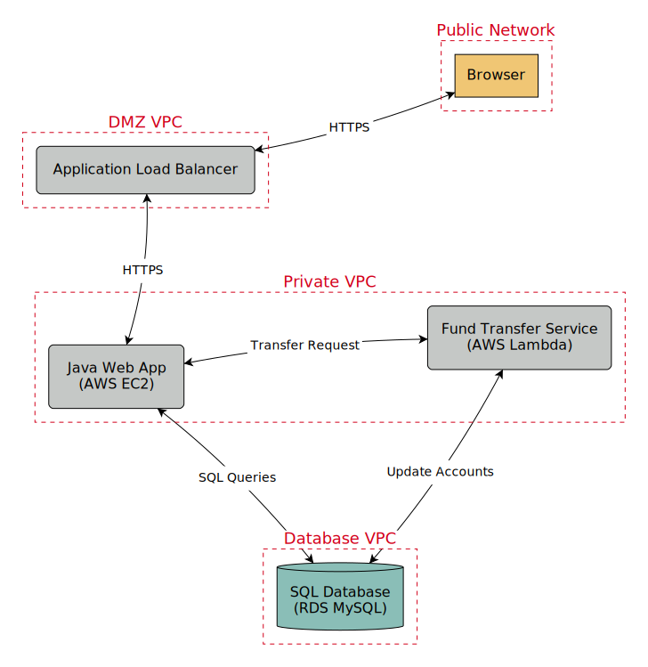

# RaD-TM — Rapid Developer-driven Threat Modeling

| Contributor     | E-Mail                            |
|-----------------|-----------------------------------|
| Alan Pestrin    | <alan.pestrin@thomsonreuters.com> |
| Andrea Scaduto  | <andrea@secureflag.com>           |
| Andrea Cardaci  | <acardaci@secureflag.com>         |
| Andrew Hainault | <andrew.hainault@aon.co.uk>       |
| Grant Ongers    | <grant.ongers@owasp.org>          |
| Stefano Ciccone | <stefano.ciccone@secureflag.com>  |

## The RaD-TM Methodology

While threat modeling is widely recognized as a critical step in building secure software, traditional approaches often attempt to model an entire application all at once. This requires a comprehensive understanding of the system from various teams, including engineering, operations, and security, which can produce overly broad findings that are difficult to refine and maintain at scale.

In modern software development, the shift-left movement emphasizes addressing potential issues early in the development lifecycle. Our Rapid Developer-driven Threat Modeling (RaD-TM) empowers software developers to incorporate threat modeling seamlessly into the development workflow. It enables them to generate threat models of individual pieces of functionality after the earliest design phase to identify and address security threats before development begins. This approach allows for quick turnarounds for security reviews and minimizes costly security rework later in the process.

Our vision is rooted in a systematic approach to building secure software containing four key stages: **Requirements**, **Design**, **Threat Modeling**, and **Development**. By integrating threat modeling during the design phase, teams are better equipped to anticipate potential risks and address them when changes are easiest and least costly to implement.

This methodology is versatile and designed to fit different contexts:

- **Individual Use:** Developers can model the threats for features they are working on individually.

- **Group Sessions:** Teams can collaboratively model potential threats for larger functionalities or an entire application.

A further limitation of traditional threat modeling is its reliance on the specialized expertise of security professionals. Most developers are not trained to systematically identify or prioritize threats, which makes traditional threat modeling methods challenging to implement without expert guidance. As these experts are scarce, it limits both the scalability of threat modeling and its adoption across large or fast-moving development organizations. The goal of this methodology is to empower developers to perform effective, lightweight threat modeling on individual features during the development workflow without requiring deep security expertise. The methodology is based on simplicity, speed, and repeatability.

Threat Templates introduce a novel approach to security standardization by eliminating the need for specialized security expertise. Rather than generating a massive threat model containing hundreds of items, our method focuses developers on identifying threats from a concise set of lists of up to 20 high-priority threats. These Threat Templates are pre-defined collections of threats and corresponding controls, each tailored to specific compliance standards, application environments, or organizational priorities. This streamlined structure guides developers—whether working individually or as part of a team to systematically identify and mitigate threats, making security a more accessible and efficient process.

The methodology makes **threat modeling accessible to all developers**, not just security experts. Its **lightweight nature** ensures it does not add significant overhead to the development workflow. Moreover, it supports **continuous refinement**, allowing threat models to evolve alongside the application's functionality, and ensures that security remains integrated throughout the development lifecycle.

By equipping developers with a structured, accessible approach to threat modeling, we enable organizations to deliver more secure software while reducing the time and effort spent on addressing security issues later in the development process. Below is a description of the six phases of our RaD-TM methodology, designed to be quick, easy, and seamlessly integrated into the development workflow. By breaking threat modeling into smaller, well-defined steps, any developer can identify and address security threats without undue overhead.

Below is a description of the six phases of our Rapid Developer-driven Threat Modeling (RaD-TM) methodology, designed to be quick, easy, and seamlessly integrated into the development workflow. By breaking threat modeling into smaller, well-defined steps, any developer can identify and address security threats without undue overhead.

### Produce a Graphical Representation

Start by creating a clear graphical representation of the functionality. This step should take no more than ten minutes per individual feature and follows the requirements phase—where stakeholders identify, analyze, and document the necessary functionalities and constraints yet often overlook security considerations. Visualizing the application's structure at this stage helps bridge the gap left by requirements, specifically capturing potential security-relevant data flows, interactions, and dependencies that might otherwise go unaddressed.

**Steps**

1. **Identify the Feature:** Clearly define the feature or functionality being analyzed (e.g., "Transfer Funds Between Accounts").

2. **Map All Elements:**

    - Identify all components involved (e.g., user interface, APIs, databases, external services).

3. **Illustrate Interactions:**

    - Show how these elements interact, such as the flow of data between components:

        1. **Inputs:** What data does the feature consume? How does it enter the system?
        2. **Outputs:** What data does the feature produce? Where does it go?
        3. Specify the type of data exchanged at each interaction (e.g., user credentials, tokens, requests, responses).

**Deliverable**

A visual representation of the feature, showing its components, interactions, and data flows. This diagram sets the foundation for identifying security threats.

### Identify Trust Boundaries

Once the functionality is mapped out, focus on identifying **trust boundaries**: points where the level of trust changes within the system. Trust boundaries are critical for pinpointing potential attack surfaces.

**Steps**

1. **Locate Trust Boundaries:**

    - Identify points where data crosses between:

        - Different trust levels (e.g., user-to-server, internal-to-external systems).

        - Privilege levels (e.g., regular user-to-admin system interactions).

        - Ownership domains (e.g., your application and third-party APIs).

2. **Highlight Security-Relevant Transitions:**

    - Mark transitions where sensitive operations occur, such as authentication, encryption, or data storage.

**Deliverable**

A list of trust boundaries identified within the system. Each of them includes one or more nodes created in the previous step.

**Example**

- **User-to-System:** Input from the user into the application (e.g., login form submission).

- **System-to-Database:** Data exchanged between the application and its database.

- **Internal-to-External:** Interactions with third-party services or APIs.

- **Privilege Changes:** Where roles or permissions escalate (e.g., user-to-admin).

### Identify Threats Using Threat Templates

**Threat Templates** empower developers to conduct threat modeling independently, reducing reliance on security experts. These concise, pre-defined collections of (max) **20 threats** and corresponding controls are tailored to specific contexts, such as:

- **Compliance Standards** (e.g., FedRAMP, PCI DSS, HIPAA, GDPR).

- **Deployment Environments** (e.g., AWS, Azure, on-premises, etc).

- **Coding Guidelines** (e.g., secure code best practices, NIST CSF, OWASP recommendations).

- **Organizational Priorities** (e.g., vulnerability patterns or high-risk areas for the business).

Threat Templates streamline threat identification by focusing on relevant threats for a feature or system, ensuring no critical threats are missed. Their structured approach simplifies the process, enabling developers to work efficiently without requiring deep security knowledge.

For best results, **Threat Templates must be created and reviewed by a security expert**. Refer to the dedicated section on **Building Threat Templates** in this paper for detailed guidance on how to develop and maintain these templates effectively.

**Steps**

1. **Select a Threat Template Aligned to a Context** (reference the Appendix, for example, Threat Templates):

    - Compliance Context: (e.g., FedRAMP, PCI DSS, HIPAA, GDPR).

    - Deployment Context: (e.g., AWS, Azure, on-premises).

    - Implementation Context: (e.g., threats due to common code vulnerabilities).

    - Organizational Priorities: (e.g., threats identified from internal vulnerability management programs).

    Multiple threat templates can be selected depending on the audience working on the Threat Model. For example, in the context of a financial application within the scope for PCI DSS and deployed on AWS, developers can use the PCI DSS and Secure Code Implementation Templates while DevOps engineers can use the AWS Threat Template. Reference the full example for more information.

2. **Match Threats to the Feature:** Identify threats from the template that apply to the feature's components or workflows.

**Deliverable**

A list of threats relevant to the feature based on the selected Threat Template.

**Example**

Example of Selected Threats from the PCI DSS Threat Template for a Banking Application.

<table>

<tr>
<th>Threat</th>
<th>Description</th>
<th>Default Severity</th>
<th>Applicable Components</th>
</tr>

<tr>
<td>Unauthorized Access to Sensitive Systems</td>
<td>Unauthorized individuals gain access to critical payment systems or administrative functions by bypassing authentication controls, potentially leading to data breaches or system compromises.</td>
<td>High</td>
<td>Back-end APIs</td>
</tr>

<tr>
<td>Unencrypted Network Connection</td>
<td>Sensitive payment data is transmitted without adequate encryption, increasing the risk of interception or theft by malicious actors.</td>
<td>Moderate</td>
<td>Data Store Backoffice Portal Back-end APIs</td>

<tr>
<td>Unauthorized Devices or Users</td>
<td>Unauthorized back-office support users gain access to payment networks, exposing data and potentially enabling fraudulent activities.</td>
<td>High</td>
<td>Backoffice Portal</td>
</tr>

<tr>
<td>Lack of Detection for Anomalies</td>
<td>Systems do not effectively identify unusual login patterns, fraudulent transactions, or suspicious network activities in a timely manner, allowing prolonged unauthorized access or financial losses.</td>
<td>Moderate</td>
<td>Backoffice Portal Back-end APIs</td>
</tr>

</table>

### Identify Controls Using Threat Templates

For each threat identified, developers select corresponding **pre-approved** controls from the same Threat Template while having the flexibility to incorporate additional security measures as needed. These controls should align with:

- **Compliance Standards** (e.g., PCI DSS requirements, NIST 800-53).

- **Deployment-Specific Guidance** (e.g., AWS Well-Architected Framework).

- **Secure Coding Best Practices** (e.g., OWASP recommendations).

- **Internal Security Policies** (e.g., mandated libraries, APIs, or business processes).

**Steps**

1. **Identify Controls:** For each threat, list the controls provided in the Threat Template.

2. **Evaluate Implementation:**

    - Implemented: Control is operational and effective.

    - Partially or not implemented: Control exists but has gaps or is missing.

3. **Document Implementation Rationale:** Provide reasons for the control's implementation status.

**Deliverable**

A list of controls from the selected Threat Template, specifically designed to mitigate the risks posed by the identified threats.

**Example**

Threat-to-Control Mapping Example.

<table>

<tr>
<th>Threat</th>
<th>Suggested Controls</th>
<th>Applicable Components</th>
<th>Control Implemented?</th>
<th>Rationale</th>
</tr>

<tr>
<td>Unauthorized Access to Sensitive Systems</td>
<td>PCI DSS Requirement 8: Identify and Authenticate Access to System Components.  Implement strong authentication methods, including unique IDs and multi-factor authentication.</td>
<td>Back-end APIs</td>
<td>Yes</td>
<td>Centralized access management and MFA are fully implemented.</td>
</tr>

<tr>
<td rowspan="3">Unencrypted Network Connection</td>
<td rowspan="3">PCI DSS Requirement 4: Encrypt Transmission of Payment Data Across Open, Public Networks.  Use strong cryptography (e.g., TLS 1.2 or higher) to protect payment data during transmission.</td>
<td>Data Store</td>
<td>Yes</td>
<td>TLS 1.2 is enforced.</td>
</tr>
<tr>
<td>Backoffice Portal</td>
<td>No</td>
<td>TLS 1.2 not enforced.</td>
</tr>
<tr>
<td>Back-end API</td>
<td>Yes</td>
<td>TLS 1.2 is enforced.</td>
</tr>

<tr>
<td>Unauthorized Devices or Users</td>
<td>PCI DSS Requirement 8: Identify and Authenticate Access to System Components  Enforce authentication for all users and devices accessing the system.</td>
<td>Backoffice Portal</td>
<td>Partially</td>
<td>Stringent authentication has been enforced for end-users, but not for back-office support agents.</td>
</tr>

<tr>
<td rowspan="2">Lack of Detection for Anomalies</td>
<td rowspan="2">PCI DSS Requirement 10: Track and Monitor All Access to Network Resources and Payment Data  Implement comprehensive logging and monitoring to detect unusual activities.</td>
<td>Backoffice Portal</td>
<td>No</td>
<td>Logging is operational, but real-time monitoring is not implemented.</td>
</tr>
<tr>
<td>Back-end API</td>
<td>No</td>
<td>Logging is operational, but real-time monitoring is not implemented.</td>
</tr>

</table>

### Rate and Prioritize Threats

For each identified threat, perform the following steps.

**Steps**

1. **Assess Severity:** Update the default severity rating of **High**, **Moderate**, or **Low** based on the likelihood of the threat occurring, its potential impact, and on the controls which have been already fully or partially implemented as documented in **Identify Controls Using Threat Templates**.

    **Note:** Each threat in a Threat Template typically comes with a default severity rating to streamline evaluation and prioritization.

2. **Determine Threat Status:**

    - **Mitigated:** The threat has been fully addressed through implemented controls.

    - **Accepted:** The threat is acknowledged and accepted because of low likelihood, minor impact, or a business decision.

    - **Open:** The threat remains unaddressed due to incomplete or missing controls.

3. **Provide Rationale:** Briefly explain why the threat is categorized as mitigated, accepted, or open. Propose actions or mitigations to address the remaining threats.

**Note:** Risk assessment considerations, including residual risk evaluation, are inherently tied to an organization's specific risk appetite and security posture. These aspects involve subjective judgments on impact and likelihood, which can vary significantly between organizations based on their controls and priorities. As such, they extend beyond the scope of this methodology, which focuses on a streamlined, developer-friendly approach to identifying and addressing threats. Instead of using risk ratings, we focus solely on severity ratings, simplifying the process while maintaining a practical approach to security. By avoiding complex risk assessments, we improve the chances of developer adoption, ensuring security is integrated efficiently without unnecessary overhead.

**Deliverable**

A report including all threats, severity ratings, and proposed mitigations.

Focus on high-severity unmitigated threats first and prioritise low-severity threats for later review.

**Example**

Threat Assessment Table Example.

<table>

<tr>
<th>Threat</th>
<th>Applicable Components</th>
<th>Rationale & Next Steps</th>
<th>Threat Status</th>
<th>Severity</th>
</tr>

<tr>
<td>Unauthorized Access to Sensitive Systems</td>
<td>Back-end APIs</td>
<td>Centralized access management and MFA are fully implemented.</td>
<td>Mitigated</td>
<td>-</td>
</tr>

<tr>
<td rowspan="3">Unencrypted Network Connection</td>
<td>Data Store</td>
<td>TLS 1.2 is enforced. No further actions required.</td>
<td>Mitigated</td>
<td>-</td>
</tr>
<tr>
<td>Backoffice Portal</td>
<td>TLS 1.2 is enforced. No further actions required.</td>
<td>Mitigated</td>
<td>-</td>
</tr>
<tr>
<td>Back-end APIs</td>
<td>TLS 1.2 is enforced. No further actions required.</td>
<td>Mitigated</td>
<td>-</td>
</tr>

<tr>
<td>Unauthorized Devices or Users</td>
<td>Backoffice Portal</td>
<td>Stringent authentication has been enforced for end-users, but not for back-office support agents. Enforce authentication for back-office support agents.</td>
<td>Open</td>
<td>High</td>
</tr>

<tr>
<td rowspan="2">Lack of Detection for Anomalies</td>
<td>Backoffice Portal</td>
<td>Logging is operational, but real-time monitoring is not implemented. Introduce real-time monitoring capabilities.</td>
<td>Open</td>
<td>Moderate</td>
</tr>

<tr>
<td>Back-end APIs</td>
<td>Logging is operational, but real-time monitoring is not implemented.</td>
<td>Open</td>
<td>Moderate</td>
</tr>

</table>

### Document Results, Automate, and Iterate

**Summarize** the threat modeling outcomes in a concise, shareable report that includes:

- Feature description

- List of identified threats and linked controls

- Control implementation status and accepted threats

- Mitigation plans for any unaddressed issues

**Store** the threat model in the same ticket or feature record (e.g., Jira, Azure DevOps), ensuring easy access for the entire team and a clear audit trail proving security was addressed during development.

**Integrate** threat modeling into routine workflows (e.g., feature refinement or sprint planning). Leverage checklists, templates, or automated tools to generate or update models automatically, reducing manual overhead and fostering continuous security awareness.

## Building Threat Templates

Creating effective Threat Templates is best done by security experts, who curate a focused set of threats and corresponding controls tailored to specific compliance standards, application environments, or organizational needs.

Threat Templates serve as the core enabler of the RaD-TM methodology by allowing organizations to have their developers focus on a concise list—no more than 20 items—tailored to each new critical functionality. This developer-focused approach removes the need for extensive brainstorming and reduces complexity while ensuring that threats and controls remain aligned with compliance and context-specific priorities. By reusing pre-approved templates, organizations simplify and accelerate their threat modeling process, maintaining a balance between thoroughness and usability through a manageable list of (ideally) a maximum of 20 entries. As a result, threat modeling becomes both accessible to developers and robust in upholding high security and compliance standards.

This chapter provides a step-by-step guide for creating Threat Templates, using threats and controls relevant to PCI DSS as an example. Alternatively, threats can be derived from CIS Benchmarks or the NIST Cybersecurity Framework (CSF), with controls mapped from NIST SP 800-53.

Reference the Appendix for examples of Threat Templates.

### Define the Scope of the Threat Template

Clearly establish the scope and context for the Threat Template to determine which threats and controls are most relevant.

- **Compliance Context:** Is the template aimed at PCI DSS, HIPAA, GDPR, or another standard?

- **Deployment Context:** Will the application run on AWS, Azure, on-premises, or embedded systems?

- **Industry Context:** Does the organization operate in banking, healthcare, automotive, or another vertical?

- **Implementation Context:** Which technologies and programming languages are being utilized?

- **Organizational Priorities:** What threats and vulnerabilities occur most often based on historical data?

For example:

- **Scope:** Banking application under PCI DSS compliance.

- **Focus:** Protecting sensitive payment data, preventing fraud, and ensuring secure authentication.

### Select Relevant Threats

Extract the most pertinent threats that align with the identified scope. For example, for a financial application subject to PCI DSS compliance, focus on threats outlined in the PCI DSS framework. Limit the total to a maximum of 20 entries, ensuring each threat aligns with the defined focus.

Map threats to specific, actionable controls. Organize the selected threats and mapped controls into a concise, developer-friendly format. Each threat should have one or more controls clearly listed for quick reference.

### Update and Maintain the Threat Template

Threat Templates should evolve over time:

- **Leverage Vulnerability Data:** Update templates based on recurring vulnerabilities identified in penetration tests or incident reports.

- **Monitor Emerging Threats:** Add new threats from industry reports or internal threat intelligence.

- **Incorporate Feedback:** Refine templates based on developer input and lessons learned during threat modeling.

## Example Threat Templates

### PCI DSS

<table>

<tr>
<th>Threat</th>
<th>Description</th>
<th>Severity Rating</th>
<th>Suggested Controls</th>
</tr>

<tr>
<td>Unauthorized Access to Cardholder Data</td>
<td>Unauthorized individuals gain access to stored cardholder data through inadequate access controls or compromised credentials.</td>
<td>High</td>
<td>PCI DSS Requirement 7: Implement strong access control measures, ensuring that only authorized personnel have access to cardholder data.  Requirement 8: Enforce unique user IDs and strong authentication methods.  Requirement 10: Maintain comprehensive audit trails of all access to network resources and cardholder data.</td>
</tr>

<tr>
<td>Inadequate Data Encryption</td>
<td>Sensitive cardholder data is not properly encrypted both at rest and in transit, making it vulnerable to interception or theft.</td>
<td>High</td>
<td>PCI DSS Requirement 3: Encrypt stored cardholder data using strong cryptography (e.g., AES-256).  Requirement 4: Encrypt transmission of cardholder data across open, public networks using TLS 1.2 or higher.  Requirement 3: Implement robust key management practices, including key rotation and secure storage.</td>
</tr>

<tr>
<td>Insufficient Physical Security</td>
<td>Physical access to systems storing cardholder data is not adequately controlled, allowing unauthorized physical access.</td>
<td>High</td>
<td>PCI DSS Requirement 9: Restrict physical access to cardholder data to authorized personnel only.  Requirement 9: Use surveillance cameras and secure access mechanisms (e.g., biometric scanners, badges) for sensitive areas.  Requirement 9: Implement visitor logs and access monitoring for facilities storing cardholder data.</td>
</tr>

<tr>
<td>Inadequate Network Security</td>
<td>Network defenses are insufficient, enabling attackers to penetrate and access cardholder data.</td>
<td>High</td>
<td>PCI DSS Requirement 1: Install and maintain a firewall configuration to protect cardholder data.  Requirement 1: Implement network segmentation to isolate cardholder data environments (CDE) from other networks.  Requirement 1: Regularly review and update firewall and router configurations.</td>
</tr>

<tr>
<td>Weak Authentication Mechanisms</td>
<td>Authentication processes are weak or improperly implemented, allowing unauthorized users to bypass security controls.</td>
<td>High</td>
<td>PCI DSS Requirement 8: Enforce multi-factor authentication (MFA) for all access to the CDE.  Requirement 8: Implement strong password policies, including complexity and rotation.  Requirement 8: Ensure that default passwords are changed and not used in production environments.</td>
</tr>

<tr>
<td>Lack of Segregation of Duties</td>
<td>Lack of proper role-based access control and segregation of duties increases the risk of insider threats and unauthorized actions.</td>
<td>High</td>
<td>PCI DSS Requirement 7: Define and enforce role-based access controls (RBAC) to ensure separation of duties.  Requirement 7: Regularly review user roles and permissions to prevent excessive access.  Requirement 7: Implement least privilege principles across all systems handling cardholder data.</td>
</tr>

<tr>
<td>Poor Vendor Management</td>
<td>Third-party vendors with access to cardholder data do not adhere to PCI DSS standards, introducing additional vulnerabilities.</td>
<td>High</td>
<td>PCI DSS Requirement 12.8: Maintain and enforce policies and procedures to manage service providers.  Requirement 12.8: Ensure third-party vendors comply with PCI DSS standards through contracts and regular assessments.  Requirement 12.8: Monitor and review third-party service provider activities related to cardholder data.</td>
</tr>

<tr>
<td>Inadequate Logging and Monitoring</td>
<td>Systems do not have sufficient logging and monitoring in place to detect and respond to security incidents involving cardholder data.</td>
<td>High</td>
<td>PCI DSS Requirement 10: Implement logging mechanisms to capture all access to network resources and cardholder data.  Requirement 10: Use a Security Information and Event Management (SIEM) system to aggregate and analyze logs.  Requirement 10: Regularly review and analyze logs for suspicious activities and anomalies.</td>
</tr>

<tr>
<td>Insufficient Incident Response</td>
<td>Lack of a robust incident response plan hinders timely and effective response to breaches or security incidents involving cardholder data.</td>
<td>High</td>
<td>PCI DSS Requirement 12.10: Develop and maintain an incident response plan.  Requirement 12.10: Conduct regular incident response drills and tabletop exercises.  Requirement 12.10: Ensure proper communication channels and roles are defined for incident management.</td>
</tr>

<tr>
<td>Incomplete or Outdated Security Policies</td>
<td>Security policies and procedures are incomplete, outdated, or not enforced, leading to gaps in security measures protecting cardholder data.</td>
<td>High</td>
<td>PCI DSS Requirement 12.2: Establish and maintain a policy that addresses information security for all personnel.  Requirement 12.2: Regularly review and update security policies to reflect current threats and compliance requirements.  Requirement 12.2: Ensure policies are communicated and enforced across the organization.</td>
</tr>

<tr>
<td>Data Retention Beyond Requirements</td>
<td>Cardholder data is retained longer than necessary, increasing the risk of exposure if compromised.</td>
<td>Moderate to High</td>
<td>PCI DSS Requirement 3.1: Limit data retention to what is necessary for business, legal, and regulatory requirements.  Requirement 3.1: Implement data retention and disposal policies that comply with PCI DSS.  Requirement 3.1: Regularly audit stored data to ensure compliance with retention limits.</td>
</tr>

<tr>
<td>Lack of Regular Security Assessments</td>
<td>Organizations do not perform regular security assessments and vulnerability scans to identify and remediate security weaknesses.</td>
<td>High</td>
<td>PCI DSS Requirement 11.2: Perform quarterly vulnerability scans and annual penetration tests.  Requirement 11.2: Use automated tools to identify and remediate vulnerabilities.  Requirement 11.2: Track and resolve security weaknesses in a timely manner based on risk prioritization.</td>
</tr>

<tr>
<td>Inadequate Change Management</td>
<td>Changes to systems and processes are not properly managed, potentially introducing new vulnerabilities or misconfigurations that affect cardholder data security.</td>
<td>High</td>
<td>PCI DSS Requirement 6.4: Implement a change control process for all system components.  Requirement 6.4: Ensure that all changes are tested and approved before deployment.  Requirement 6.4: Maintain documentation for all changes, including approvals and testing results.</td>
</tr>

<tr>
<td>Unauthorized Software Installation</td>
<td>Unauthorized or unapproved software is installed on systems handling cardholder data, potentially introducing vulnerabilities.</td>
<td>High</td>
<td>PCI DSS Requirement 6.3: Develop software applications securely, following secure coding standards.  Requirement 6.3: Implement application whitelisting to prevent unauthorized software installations.  Requirement 6.3: Regularly audit installed software and remove unauthorized or unnecessary applications.</td>
</tr>

<tr>
<td>Insecure Backup Practices</td>
<td>Backups containing cardholder data are not securely stored or encrypted, risking unauthorized access and data breaches.</td>
<td>High</td>
<td>PCI DSS Requirement 9.9: Protect all backup media and ensure that it is stored securely.  Requirement 9.9: Encrypt backup data to protect it from unauthorized access.  Requirement 9.9: Regularly test backup restoration processes to ensure data integrity and availability.</td>
</tr>

<tr>
<td>Inadequate Employee Training</td>
<td>Employees are not adequately trained on security policies, procedures, and best practices for handling cardholder data, increasing the risk of human error.</td>
<td>Moderate to High</td>
<td>PCI DSS Requirement 12.6: Train personnel on security policies and procedures.  Requirement 12.6: Conduct regular security awareness training to educate employees about data protection and compliance.  Requirement 12.6: Evaluate the effectiveness of training programs through assessments and simulations.</td>
</tr>

<tr>
<td>Improper Data Masking or Tokenization</td>
<td>Sensitive cardholder data is not masked or tokenized in environments where it is not needed, increasing the risk of exposure.</td>
<td>High</td>
<td>PCI DSS Requirement 3.4: Mask PAN when displayed (e.g., truncation, encryption).  Requirement 3.4: Implement tokenization to replace PAN with tokens in non-secure environments.  Requirement 3.4: Ensure that masking and tokenization techniques are consistently applied across all systems handling cardholder data.</td>
</tr>

<tr>
<td>Inadequate Access Revocation</td>
<td>When employees or contractors leave the organization, their access to cardholder data is not promptly and effectively revoked, increasing the risk of misuse.</td>
<td>High</td>
<td>PCI DSS Requirement 7.1: Limit access to cardholder data to only those individuals whose job requires it.  Requirement 7.1: Implement processes to revoke access promptly when an employee leaves or changes roles.  Requirement 7.1: Regularly review and update access rights to ensure they remain appropriate.</td>
</tr>

<tr>
<td>Insecure Data Handling</td>
<td>Sensitive data is not handled securely throughout its lifecycle, from collection to processing to storage, increasing the risk of unauthorized access or modification.</td>
<td>High</td>
<td>PCI DSS Requirement 3.5: Protect stored cardholder data by implementing strong access controls.  Requirement 3.5: Ensure that sensitive data is handled securely throughout its lifecycle, including collection, processing, and storage.  Requirement 3.5: Implement data handling procedures that comply with PCI DSS standards.</td>
</tr>

</table>

### Secure Code Implementation

<table>

<tr>
<th>Threat</th>
<th>Description</th>
<th>Severity Rating</th>
<th>Suggested Controls</th>
</tr>

<tr>
<td>Logic Bugs</td>
<td>Errors in application logic can lead to subversion of security requirements, potentially allowing unauthorized actions with an impact specific to the application in scope.</td>
<td>High</td>
<td>Conduct thorough code reviews and testing to identify and fix logic errors.  Use automated tools to detect logical flaws and ensure secure application logic.</td>
</tr>

<tr>
<td>Broken Access Control</td>
<td>Involves flaws where application logic does not properly enforce user roles or permissions, letting unauthorized users access restricted resources or perform privileged actions.</td>
<td>High</td>
<td>Implement server-side authorization checks.  Follow the principle of least privilege.  Use robust role-based or attribute-based access controls.</td>
</tr>

<tr>
<td>Insecure Direct Object References (IDOR)</td>
<td>Occurs when an application exposes references to internal implementation objects (like database records, file names, URIs) without proper checks, allowing attackers to manipulate these references to access unauthorized data.</td>
<td>High</td>
<td>Implement access control checks at every layer (object-level authorization).  Use randomized or hashed references (not easily guessable).  Validate user permissions before returning data.</td>
</tr>

<tr>
<td>Cryptographic Failures</td>
<td>Results from using weak or outdated algorithms, improper key management, or failing to encrypt sensitive data at rest or in transit.</td>
<td>High</td>
<td>Use modern, reputable encryption libraries (e.g., AES-256, RSA-2048).  Enforce TLS/HTTPS for data in transit.  Securely store and rotate keys.</td>
</tr>

<tr>
<td>Hard-coded Credentials</td>
<td>Storing passwords, tokens, or keys in code or configuration files can allow attackers who gain access to the source or binary to immediately exploit those credentials for unauthorized system or data access.</td>
<td>High</td>
<td>Use environment variables or secure credential storage (e.g., vaults).  Regularly rotate secrets and keys.  Implement code scanning tools to detect hard-coded credentials.</td>
</tr>

<tr>
<td>Default or Guessable Passwords</td>
<td>Using manufacturer default credentials or weak, guessable passwords can allow attackers to gain unauthorized access.</td>
<td>High</td>
<td>Enforce password complexity requirements.  Prompt users to change default credentials upon first use.  Implement account lockout policies and MFA.</td>
</tr>

<tr>
<td>OS Command Injection</td>
<td>Happens when an attacker can run arbitrary code on the target system by exploiting flaws in input validation, deserialization, or command execution within the application.</td>
<td>High</td>
<td>Strictly validate and sanitize all user-supplied data.  Avoid unsafe APIs (e.g., direct calls to OS shells).  Containerize or sandbox risky code paths to limit damage.</td>
</tr>

<tr>
<td>SQL Injection</td>
<td>Occurs when malicious SQL statements are injected into a query via user input, potentially allowing attackers to read, modify, or delete database information.</td>
<td>High</td>
<td>Use parameterized queries or stored procedures.  Implement input validation and sanitization.  Enforce least-privilege DB access.</td>
</tr>

<tr>
<td>LDAP Injection</td>
<td>Similar to SQL injection, this happens when untrusted input is injected into an LDAP statement, potentially altering directory queries and allowing attackers to bypass authentication or retrieve sensitive information from an LDAP server.</td>
<td>Moderate to High</td>
<td>Sanitize and encode user input used in LDAP queries.  Use parameterized LDAP queries (where available).  Implement strict access controls on directory services.</td>
</tr>

<tr>
<td>Cross-Site Scripting (XSS)</td>
<td>Allows attackers to inject client-side scripts into web pages viewed by other users, potentially stealing session tokens, redirecting users, or performing unauthorized actions.</td>
<td>High</td>
<td>Employ output encoding (e.g., HTML-escape user inputs).  Use secure frameworks/libraries to handle templates.  Validate all user data.</td>
</tr>

<tr>
<td>Race Conditions / Concurrency Issues</td>
<td>Occur when multiple processes or threads access shared resources in a way that can lead to unexpected behavior (e.g., overwriting data, inconsistent updates), potentially causing data integrity issues or unauthorized actions.</td>
<td>Moderate</td>
<td>Use proper locking or synchronization mechanisms.  Validate shared resource states before and after updates.  Employ transactional operations where possible.</td>
</tr>

<tr>
<td>Logging Sensitive Data</td>
<td>Storing personally identifiable information (PII), session tokens, or passwords in logs can expose them to unintended parties if log files are compromised or improperly accessed.</td>
<td>Moderate</td>
<td>Sanitize or mask sensitive fields before logging.  Restrict access to log files and encrypt logs at rest.  Implement log retention policies and secure disposal.</td>
</tr>

<tr>
<td>Cross-Site Request Forgery (CSRF)</td>
<td>Tricks an authenticated user's browser into sending malicious requests to a site they are logged into, allowing unauthorized actions or data manipulation.</td>
<td>Moderate</td>
<td>Use anti-CSRF tokens in forms.  Implement same-site cookie attributes and headers.  Require re-authentication for sensitive actions.</td>
</tr>

<tr>
<td>Server-Side Request Forgery (SSRF)</td>
<td>Allows an attacker to trick the server into making unintended requests to internal or external services, which can expose internal network resources or sensitive information.</td>
<td>Moderate</td>
<td>Validate and sanitize all URLs or endpoints.  Restrict outbound traffic with allowlists/firewalls.  Use network segmentation to limit internal resource exposure.  Disable unneeded protocols.</td>
</tr>

<tr>
<td>Insecure Deserialization</td>
<td>Happens when untrusted or tampered serialized data is accepted and deserialized without proper validation, potentially allowing code injection or object manipulation.</td>
<td>Moderate</td>
<td>Use formats that support integrity checks (e.g., JSON + signatures).  Validate all serialized data before deserialization.  Restrict or disable object deserialization if possible.</td>
</tr>

<tr>
<td>Directory Traversal</td>
<td>Attackers manipulate file paths (e.g., using ../ sequences) to access files or directories outside the intended scope, potentially reading sensitive files or executing arbitrary scripts.</td>
<td>Moderate</td>
<td>Validate and sanitize all user-input file paths.  Use strict server-side path handling (disallow ../ in user input).  Implement principle of least privilege for file system access.</td>
</tr>

<tr>
<td>XML External Entities (XXE)</td>
<td>When an application parses XML that includes external entity references, attackers can exploit these references to access local files, cause denial of service, or perform SSRF (Server-Side Request Forgery) attacks.</td>
<td>Moderate</td>
<td>Disable DTDs (Document Type Definitions) if not needed.  Use secure XML parsers that do not allow external entity expansion.  Validate all XML inputs and monitor for suspicious references.</td>
</tr>

<tr>
<td>Unvalidated Redirects & Forwards</td>
<td>Occurs when an application redirects or forwards users to another page or site, and the target is not validated. Attackers can use this to phish users or launch other malicious exploits.</td>
<td>Moderate</td>
<td>Avoid using redirects/forwards unless essential.  Validate destination URLs against an allow-list.  Display clear warnings if redirects are necessary.</td>
</tr>

<tr>
<td>Denial of Service (DoS)</td>
<td>Involves overwhelming a server, network, or service (e.g., by sending excessive requests), making the application unavailable to legitimate users.</td>
<td>Moderate</td>
<td>Implement rate limiting and throttling.  Use load balancers or CDNs to distribute traffic.  Monitor for unusual traffic patterns and activate mitigation strategies (e.g., WAF rules).</td>
</tr>

<tr>
<td>Insufficient Logging & Monitoring</td>
<td>Occurs when security-related events are not logged or monitored, hindering the ability to detect or respond to breaches effectively.</td>
<td>Moderate</td>
<td>Implement centralized logging (e.g., SIEM).  Establish clear alerting and incident response procedures.  Regularly review and audit logs.</td>
</tr>

</table>

### AWS

<table>

<tr>
<th>Threat</th>
<th>Description</th>
<th>Severity Rating</th>
<th>Suggested Controls</th>
</tr>

<tr>
<td>IAM Policy Misconfiguration</td>
<td>Overly permissive IAM policies (e.g., iam:FullAccess) can grant users or roles more privileges than needed, increasing the blast radius if credentials are compromised.</td>
<td>High</td>
<td>Adopt least-privilege principles (restrict privileges to what is strictly needed).  Use AWS Managed Policies or well-tested custom policies.  Continuously review IAM roles and policies for unnecessary or high-risk permissions.</td>
</tr>

<tr>
<td>API Gateway Misconfiguration</td>
<td>Failing to enable authorization (IAM, Cognito, or custom authorizers) or leaving endpoints wide open can let attackers call APIs without permission, leading to data leaks or unintended actions.</td>
<td>High</td>
<td>Require authentication and authorization for all API methods.  Use WAF or Shield for DDoS protection.  Enforce rate limiting with usage plans.  Log and monitor API activity with Amazon CloudWatch or Kinesis.</td>
</tr>

<tr>
<td>Exposed AWS Access Keys</td>
<td>Storing or accidentally publishing AWS secret/access keys (e.g., in public GitHub repos, Docker images) can let attackers gain unauthorized access to AWS resources.</td>
<td>High</td>
<td>Rotate keys frequently and use AWS Secrets Manager or AWS Systems Manager Parameter Store.  Configure automated scans for key exposure (e.g., Git secrets scanning).  Use IAM Roles instead of static keys whenever possible.</td>
</tr>

<tr>
<td>Unencrypted Data at Rest</td>
<td>Not using encryption for data stored in S3, EBS volumes, RDS databases, or other storage services may expose sensitive information if the underlying storage is compromised.</td>
<td>High</td>
<td>Use AWS KMS-managed or customer-managed keys for EBS, RDS, and S3 encryption.  Enforce encryption at rest using IAM policies and AWS Config rules.  Periodically validate that encryption is enabled across all storage resources.</td>
</tr>

<tr>
<td>S3 Bucket Misconfiguration</td>
<td>When S3 buckets are left publicly readable/writable or have overly permissive Access Control Lists (ACLs) or bucket policies, attackers can access, modify, or delete data.</td>
<td>High</td>
<td>Use S3 Block Public Access settings.  Enforce least-privilege IAM policies for bucket access.  Enable Server Access Logging on buckets.  Regularly audit S3 permissions with AWS Config or third-party tools.</td>
</tr>

<tr>
<td>EC2 Snapshot Exposures</td>
<td>Snapshots of EBS volumes made public (intentionally or accidentally) can reveal sensitive data (customer info, system credentials, etc.).</td>
<td>High</td>
<td>Mark snapshots as private by default and limit who can share them.  Regularly audit snapshot sharing settings using AWS Config or custom scripts.  Encrypt EBS volumes and snapshots with AWS KMS.</td>
</tr>

<tr>
<td>Route 53 DNS Misconfiguration or Hijacking</td>
<td>If domain ownership or DNS settings are compromised (e.g., via stolen registrar credentials), attackers can redirect traffic to malicious sites, impacting availability and data integrity.</td>
<td>High</td>
<td>Use Route 53 DNSSEC to protect zone integrity.  Lock domain registrar accounts and enable MFA.  Regularly audit DNS changes via CloudTrail and set up alerts for unauthorized modifications.</td>
</tr>

<tr>
<td>Insecure Serverless (Lambda) Configuration</td>
<td>Poorly configured AWS Lambda functions (e.g., excessive IAM privileges, exposed environment variables containing secrets) can give attackers a foothold into the AWS environment if a function is exploited.</td>
<td>Moderate to High</td>
<td>Grant least-privilege IAM roles to Lambda functions.  Store sensitive data in AWS Secrets Manager or Parameter Store instead of environment variables.  Use VPC connectivity only if needed; restrict outbound traffic where possible.</td>
</tr>

<tr>
<td>Misconfigured Amazon EKS or ECS Clusters</td>
<td>When container orchestration services are not locked down (e.g., open dashboard endpoints, unprotected metadata services, weak IAM roles for tasks/pods), attackers can escalate privileges within the cluster or gain unauthorized access to containers or data.</td>
<td>Moderate to High</td>
<td>Restrict cluster access (e.g., API server) to trusted networks.  Use IAM Roles for Service Accounts in EKS.  Leverage security groups, network policies, and pod security policies.  Keep container images updated and scanned.</td>
</tr>

<tr>
<td>ECR (Elastic Container Registry) Exposed</td>
<td>Making ECR repositories publicly accessible or misconfiguring policies may allow attackers to pull or push malicious images, risking compromise of containerized workloads.</td>
<td>High</td>
<td>Set ECR repos to private and use IAM roles for access.  Scan images for vulnerabilities (AWS ECR image scanning).  Restrict cross-account access to ECR repos.  Use lifecycle policies to remove old or vulnerable images.</td>
</tr>

<tr>
<td>EC2 Metadata Exposure</td>
<td>An attacker who gains access to the instance can query the instance metadata service (IMDS) to retrieve temporary credentials or sensitive data (e.g., IAM role tokens), leading to privilege escalation.</td>
<td>Moderate</td>
<td>Use Instance Metadata Service v2 (IMDSv2) which requires session-oriented requests.  Limit access to IMDS from inside the instance via host-based firewalls.  Enforce strong boundary controls (e.g., WAF, Security Groups).</td>
</tr>

<tr>
<td>Overly Permissive Security Groups</td>
<td>When security groups allow inbound or outbound traffic from any IP (e.g., 0.0.0.0/0) or broad port ranges, it can expose instances or services to the internet, increasing the risk of intrusion.</td>
<td>Moderate to High</td>
<td>Implement least-privilege network design (restrict ports/IP ranges).  Automate checks using AWS Config rules (e.g., disallow open Security Groups).  Use a VPC with subnets and Network ACLs for layered defense.</td>
</tr>

<tr>
<td>RDS Security Oversights</td>
<td>Publicly accessible RDS instances or default credentials/configurations can allow unauthorized access to databases, risking a data breach.</td>
<td>Moderate to High</td>
<td>Disable public access to RDS wherever possible.  Use security groups to limit inbound connections.  Enforce encryption at rest and in transit (SSL/TLS).  Apply principle of least privilege for database users and roles.</td>
</tr>

<tr>
<td>Insecure VPC Configuration</td>
<td>Poorly configured VPCs (e.g., improper route tables, no subnet separation for public-facing vs. private resources) can expose internal services and data to the public internet.</td>
<td>Moderate</td>
<td>Separate public and private subnets, use NAT Gateways or VPC Endpoints.  Restrict inbound/outbound traffic with Network ACLs and Security Groups.  Monitor and audit VPC Flow Logs for suspicious traffic.</td>
</tr>

<tr>
<td>CloudFormation Template Vulnerabilities</td>
<td>Hard-coded credentials, improper resource configurations, or excessive IAM permissions in templates can create systemic security holes if deployed.</td>
<td>Moderate to High</td>
<td>Remove any hard-coded credentials or secrets.  Use AWS IAM to manage required permissions at the resource level.  Validate templates with tools like cfn-lint or AWS CloudFormation Guard.  Keep CloudFormation templates versioned.</td>
</tr>

<tr>
<td>CloudFront Misconfiguration</td>
<td>Incorrect CloudFront distributions (e.g., allowing HTTP instead of HTTPS, no origin access control) can expose data in transit or allow unauthorized content tampering.</td>
<td>Moderate</td>
<td>Enforce HTTPS-only viewers and origin connections.  Use Origin Access Control/Identity (OAC/OAI) to lock down S3 buckets.  Configure WAF rules to filter malicious traffic.</td>
</tr>

<tr>
<td>AWS WAF Misconfiguration</td>
<td>A misconfigured Web Application Firewall (WAF) might allow malicious traffic through or incorrectly block legitimate traffic, undermining security and availability.</td>
<td>Moderate</td>
<td>Continuously tune WAF rulesets (e.g., AWS Managed Rules, custom rules).  Test thoroughly in a staging environment before production.  Integrate WAF logs with SIEM solutions to monitor for unusual traffic.</td>
</tr>

<tr>
<td>KMS Key Policy Loopholes</td>
<td>Poorly defined or overly broad Key Management Service (KMS) key policies can let unauthorized IAM principals use encryption keys, leading to data exfiltration or the inability to decrypt business-critical data.</td>
<td>Moderate to High</td>
<td>Define explicit KMS key policies; avoid using wildcard principals (*).  Regularly review who can use and administer KMS keys.  Rotate keys based on compliance requirements and use AWS Config rules to track policy changes.</td>
</tr>

<tr>
<td>AWS Secrets Manager Misconfiguration</td>
<td>Storing secrets without proper rotation, or granting wide access to secrets, can let attackers exploit credentials or tokens.</td>
<td>Moderate to High</td>
<td>Enforce automatic rotation of database credentials, API keys, etc.  Use strict resource-based policies to limit who can retrieve secrets.  Monitor AWS Secrets Manager logs (e.g., CloudTrail) to detect suspicious secret accesses.</td>
</tr>

<tr>
<td>AWS Elastic Beanstalk Misconfiguration</td>
<td>Default or permissive Elastic Beanstalk environments may expose logs, environment variables, or admin consoles.</td>
<td>Moderate</td>
<td>Restrict environment access and application URLs behind AWS WAF or an ALB with secure security groups.  Store sensitive configs in AWS Secrets Manager or Parameter Store.  Configure health checks and monitoring for anomalies.</td>
</tr>

</table>

<!-- AZURE -->
  ### Azure
  <table>
    <tr>
      <th>Threat</th><th>Description</th><th>Severity Rating</th><th>Suggested Controls</th>
    </tr>
    <tr><td>Compromised Azure AD account</td><td>An attacker gains access to an Azure AD user or admin account and controls subscriptions or data.</td><td>High</td><td>Enforce MFA, conditional access, passwordless auth, disable legacy protocols.</td></tr>
    <tr><td>Stolen service principal or client secret</td><td>Leaked or hard-coded client secrets allow unauthorized automation or API access.</td><td>High</td><td>Use managed identities, Key Vault secret rotation, audit App Registrations.</td></tr>
    <tr><td>Over-privileged RBAC roles</td><td>Excessive permissions on users or service principals increase attack surface.</td><td>High</td><td>Implement least privilege, review RBAC assignments, use PIM for JIT access.</td></tr>
    <tr><td>Public Storage Account containers</td><td>Blob containers set to public allow data leakage.</td><td>High</td><td>Disable public access, use Private Endpoints, monitor anonymous access.</td></tr>
    <tr><td>Key Vault public endpoint exposure</td><td>Vault accessible from internet without network restrictions.</td><td>High</td><td>Restrict via Private Endpoint and access policies, enable firewall rules.</td></tr>
    <tr><td>Missing patch management on VMs</td><td>Outdated images expose known vulnerabilities.</td><td>High</td><td>Use Update Management, hardened base images, Defender for Cloud.</td></tr>
    <tr><td>NSG overly permissive rules</td><td>Open inbound/outbound traffic allows lateral movement or external exposure.</td><td>High</td><td>Restrict NSG rules, apply least privilege networking, log NSG flows.</td></tr>
    <tr><td>Misconfigured Azure Firewall / WAF</td><td>Weak or absent layer-7 filtering allows attacks through web endpoints.</td><td>Moderate</td><td>Enable WAF with OWASP rules, restrict inbound IPs, monitor logs.</td></tr>
    <tr><td>Shared admin accounts</td><td>Shared credentials limit accountability and increase compromise risk.</td><td>Moderate</td><td>Use individual accounts, enforce PIM, disable shared secrets.</td></tr>
    <tr><td>Missing diagnostic / activity logs</td><td>Incomplete logging delays incident detection.</td><td>Moderate</td><td>Enable Azure Monitor, send logs to Sentinel, ensure retention policies.</td></tr>
    <tr><td>Exposed management ports (RDP/SSH)</td><td>Directly exposed ports to internet allow brute force or remote access.</td><td>High</td><td>Use Just-in-Time (JIT) VM access, restrict IPs, require VPN.</td></tr>
    <tr><td>Misconfigured App Service auth</td><td>Web apps not enforcing authentication allow data exposure.</td><td>High</td><td>Enable Azure AD or OAuth auth, require HTTPS, disable anonymous access.</td></tr>
    <tr><td>Data not encrypted at rest</td><td>Storage or DB without encryption enable data theft.</td><td>High</td><td>Use Azure Storage Service Encryption, TDE for SQL, customer-managed keys.</td></tr>
    <tr><td>Weak key rotation policy</td><td>Keys and secrets not rotated regularly remain vulnerable.</td><td>Moderate</td><td>Automate rotation, use Managed Identities, audit expiry dates.</td></tr>
    <tr><td>Insufficient backup protection</td><td>Backup storage can be deleted or overwritten by attacker.</td><td>Moderate</td><td>Enable soft delete and immutable backups, restrict delete permissions.</td></tr>
    <tr><td>Unrestricted outbound internet access</td><td>Workloads can reach arbitrary endpoints, risk of data exfiltration.</td><td>Moderate</td><td>Use NSG egress restrictions, proxy/firewall, Defender for Cloud egress alerts.</td></tr>
    <tr><td>Lack of tagging / asset inventory</td><td>Untracked resources create blind spots for security monitoring.</td><td>Low-Moderate</td><td>Enforce tagging policy, use Azure Policy for compliance and inventory.</td></tr>
    <tr><td>Resource locks missing</td><td>Critical resources can be deleted by mistake or attacker.</td><td>Moderate</td><td>Apply resource locks (CanNotDelete), audit removal attempts.</td></tr>
    <tr><td>Misconfigured Azure Policy compliance</td><td>Policies not enforced allow non-compliant deployments.</td><td>Moderate</td><td>Use initiative assignments, deployIfNotExists rules, monitor compliance.</td></tr>
    <tr><td>Insecure API Management configuration</td><td>APIs expose sensitive backend endpoints.</td><td>High</td><td>Use OAuth 2.0, validate JWT tokens, enable rate limiting and logging.</td></tr>
  </table>

  <!-- GCP -->
  ### GCP
  <table>
    <tr>
      <th>Threat</th><th>Description</th><th>Severity Rating</th><th>Suggested Controls</th>
    </tr>
    <tr><td>Leaked service account JSON key</td><td>Static credentials leaked allow full API access.</td><td>High</td><td>Avoid long-lived keys, prefer Workload Identity, rotate and disable unused keys.</td></tr>
    <tr><td>Public Cloud Storage bucket</td><td>Bucket misconfigured for public access leaks data.</td><td>High</td><td>Disable public ACLs, enforce uniform bucket-level access, use IAM only.</td></tr>
    <tr><td>Over-privileged IAM roles</td><td>Excessive permissions allow privilege escalation.</td><td>High</td><td>Apply least privilege, audit IAM bindings, use organization-level policies.</td></tr>
    <tr><td>Exposed GKE cluster master endpoint</td><td>Control plane open to internet allows exploitation.</td><td>High</td><td>Use private clusters, restrict control plane CIDR, enable authorized networks.</td></tr>
    <tr><td>Vulnerable container images</td><td>Unscanned or outdated images enable exploits.</td><td>Moderate-High</td><td>Use Artifact Registry scanning, Binary Authorization, image signing.</td></tr>
    <tr><td>Misconfigured firewall rules</td><td>Broad ingress/egress in VPC exposes internal resources.</td><td>High</td><td>Apply least-privilege rules, audit VPC Firewall Rules Logs.</td></tr>
    <tr><td>Weak service account key rotation</td><td>Keys not rotated or revoked after use.</td><td>Moderate</td><td>Automate rotation, disable manual key creation.</td></tr>
    <tr><td>Insufficient Cloud Audit Logs</td><td>Missing logs prevent detection of unauthorized activity.</td><td>Moderate</td><td>Enable all audit logs (ADMIN_READ, DATA_WRITE/READ), export to SIEM.</td></tr>
    <tr><td>Missing VPC Service Controls</td><td>Data exfiltration from sensitive projects via API endpoints.</td><td>High</td><td>Define VPC-SC perimeters, restrict private connectivity.</td></tr>
    <tr><td>Shared projects for dev/prod</td><td>Cross-environment access leads to data leakage.</td><td>Moderate</td><td>Separate projects by environment, use org folders and policies.</td></tr>
    <tr><td>Weak organization policy enforcement</td><td>Unrestricted resource creation leads to compliance gaps.</td><td>Moderate</td><td>Apply org-policy constraints (e.g., allowed images, regions).</td></tr>
    <tr><td>No encryption on persistent disks</td><td>Data at rest exposed if disk copied or stolen.</td><td>High</td><td>Enable CMEK, enforce encryption on all storage.</td></tr>
    <tr><td>Unrestricted Cloud Functions endpoints</td><td>Public invocations enable abuse or data leakage.</td><td>Moderate-High</td><td>Restrict via IAM, require authentication, validate inputs.</td></tr>
    <tr><td>Insecure BigQuery dataset sharing</td><td>Datasets shared publicly or with broad access.</td><td>High</td><td>Restrict dataset access to groups, audit access lists.</td></tr>
    <tr><td>Weak password / OAuth consent misuse</td><td>Users authorize malicious OAuth apps.</td><td>Moderate</td><td>Enforce OAuth consent screen verification, educate users, limit scopes.</td></tr>
    <tr><td>Disabled Cloud KMS key rotation</td><td>Old encryption keys increase risk of compromise.</td><td>Moderate</td><td>Automate key rotation, monitor key age and use.</td></tr>
    <tr><td>Unpatched GCE VMs</td><td>Vulnerable images exploited remotely.</td><td>High</td><td>Enable OS patch management, use VM Manager compliance reports.</td></tr>
    <tr><td>Disabled Cloud Armor / WAF</td><td>Public web endpoints lack DDoS protection.</td><td>Moderate</td><td>Deploy Cloud Armor, use rate limiting, geo-blocking.</td></tr>
    <tr><td>Lack of DLP controls for sensitive data</td><td>PHI/PII stored in GCS or BQ without DLP checks.</td><td>Moderate</td><td>Enable Cloud DLP scans, classify data, enforce alerts.</td></tr>
    <tr><td>Ineffective monitoring and alerting</td><td>Security events unmonitored, delays incident response.</td><td>Moderate</td><td>Enable Security Command Center, integrate SIEM, define alerting policies.</td></tr>
  </table>

  <!-- HIPAA -->
  ### HIPAA
  <table>
    <tr>
      <th>Threat</th><th>Description</th><th>Severity Rating</th><th>Suggested Controls</th>
    </tr>
    <tr><td>Unauthorized access to PHI</td><td>Users gain PHI access without legitimate need.</td><td>High</td><td>Enforce RBAC, MFA, least privilege, regular access reviews.</td></tr>
    <tr><td>PHI transmitted without encryption</td><td>Unencrypted transmission exposes PHI to interception.</td><td>High</td><td>Enforce TLS 1.2+, VPNs for remote connections, disable insecure protocols.</td></tr>
    <tr><td>PHI stored without encryption</td><td>PHI at rest left unencrypted on disks or backups.</td><td>High</td><td>Apply AES-256 encryption, use HSM/KMS, limit key access.</td></tr>
    <tr><td>Weak or absent key management</td><td>Poor key lifecycle handling enables decryption by attackers.</td><td>High</td><td>Enforce KMS rotation, separation of duties, key usage logging.</td></tr>
    <tr><td>Incomplete audit trails</td><td>Lack of access logs hinders detection of misuse.</td><td>Moderate-High</td><td>Enable detailed auditing, retain per HIPAA retention period, SIEM correlation.</td></tr>
    <tr><td>Insider misuse of PHI</td><td>Employees intentionally or accidentally leak PHI.</td><td>High</td><td>Implement DLP, least privilege, user behavior analytics, training.</td></tr>
    <tr><td>Inadequate BAA coverage</td><td>Third-party vendors lack Business Associate Agreements.</td><td>High</td><td>Execute BAAs, verify compliance, maintain vendor inventory.</td></tr>
    <tr><td>Insufficient breach notification plan</td><td>Delayed or missing notifications after incident.</td><td>Moderate</td><td>Define breach policy, response timelines, stakeholder roles.</td></tr>
    <tr><td>Insecure disposal of PHI</td><td>Data remnants on retired media lead to disclosure.</td><td>Moderate</td><td>Apply secure erasure, degaussing, verified destruction processes.</td></tr>
    <tr><td>Backup media unprotected</td><td>Unencrypted backups can be lost or stolen.</td><td>High</td><td>Encrypt backups, isolate physically/logically, test restores.</td></tr>
    <tr><td>PHI in logs or telemetry</td><td>Logging inadvertently captures PHI.</td><td>Moderate</td><td>Redact sensitive fields, sanitize logs before aggregation.</td></tr>
    <tr><td>Over-exposed cloud storage</td><td>Misconfigured cloud bucket exposes PHI publicly.</td><td>High</td><td>Apply strict ACLs, disable public access, continuous monitoring.</td></tr>
    <tr><td>Lack of access recertification</td><td>Access rights not periodically reviewed.</td><td>Moderate</td><td>Perform quarterly recertifications, auto-remove inactive accounts.</td></tr>
    <tr><td>Weak endpoint security</td><td>Endpoints storing PHI lack AV or encryption.</td><td>Moderate-High</td><td>Deploy EDR, enforce device encryption, patch management.</td></tr>
    <tr><td>No segregation of environments</td><td>Mixing test and production PHI data risks leaks.</td><td>Moderate</td><td>Use anonymized data in test, enforce environment separation.</td></tr>
    <tr><td>Missing DLP email controls</td><td>PHI sent via unsecured email channels.</td><td>Moderate-High</td><td>Implement DLP scanning, encrypt outbound emails.</td></tr>
    <tr><td>Poor identity lifecycle management</td><td>Orphaned accounts retain PHI access.</td><td>Moderate</td><td>Automate provisioning/deprovisioning, sync with HR system.</td></tr>
    <tr><td>Weak physical access controls</td><td>Unauthorized individuals can access servers storing PHI.</td><td>High</td><td>Secure server rooms, badge systems, CCTV, visitor logs.</td></tr>
    <tr><td>Ineffective training &amp; awareness</td><td>Staff unaware of HIPAA obligations.</td><td>Moderate</td><td>Mandatory annual HIPAA/security training, phishing simulations.</td></tr>
    <tr><td>No formal risk assessment</td><td>Organization lacks periodic HIPAA risk analysis.</td><td>Moderate</td><td>Perform annual risk assessments, track remediation, document results.</td></tr>
  </table>

  <!-- PRIVACY -->
  ### Privacy
  <table>
    <tr>
      <th>Threat</th><th>Description</th><th>Severity Rating</th><th>Suggested Controls</th>
    </tr>
    <tr><td>Unlawful data collection</td><td>Data collected without proper consent or legal basis.</td><td>High</td><td>Implement consent management, lawful basis registry, periodic audits.</td></tr>
    <tr><td>Excessive data retention</td><td>Personal data kept longer than necessary.</td><td>Moderate</td><td>Define retention schedules, automate deletion, document justification.</td></tr>
    <tr><td>Inadequate data minimization</td><td>Collecting more personal data than required.</td><td>Moderate</td><td>Apply data minimization policies, perform DPIA.</td></tr>
    <tr><td>Lack of user consent tracking</td><td>No record of user consent for processing.</td><td>High</td><td>Maintain consent logs, enable withdrawal mechanisms.</td></tr>
    <tr><td>Cross-border data transfer non-compliance</td><td>Data transferred to non-approved countries without safeguards.</td><td>High</td><td>Use SCCs, BCRs, or equivalent legal frameworks.</td></tr>
    <tr><td>Insufficient anonymization/pseudonymization</td><td>Poor de-identification leads to re-identification risk.</td><td>Moderate-High</td><td>Apply irreversible anonymization, monitor re-ID risk.</td></tr>
    <tr><td>Unauthorized data sharing with third parties</td><td>Sharing personal data without data sharing agreement.</td><td>High</td><td>Require DPAs with vendors, limit purpose, perform due diligence.</td></tr>
    <tr><td>Weak access controls on personal data</td><td>Overly broad access to user data.</td><td>High</td><td>Enforce least privilege, MFA, regular access review.</td></tr>
    <tr><td>Incomplete breach notification process</td><td>No timely notification to regulators or users.</td><td>Moderate-High</td><td>Define breach workflow, retain notification templates, test process.</td></tr>
    <tr><td>Insufficient privacy-by-design</td><td>New features ignore privacy principles.</td><td>Moderate</td><td>Perform DPIAs early in design, embed privacy review in SDLC.</td></tr>
    <tr><td>Insecure data deletion</td><td>Deleted records remain recoverable.</td><td>Moderate</td><td>Apply secure wipe and verification, validate backups.</td></tr>
    <tr><td>Data subject request mishandling</td><td>DSRs (access, deletion) not handled correctly.</td><td>Moderate</td><td>Define DSR process, track requests, verify identity.</td></tr>
    <tr><td>Inaccurate data records</td><td>Stale or incorrect data kept, violating accuracy principle.</td><td>Low-Moderate</td><td>Implement correction workflows, periodic data validation.</td></tr>
    <tr><td>Missing records of processing activities (ROPA)</td><td>No central inventory of personal data flows.</td><td>Moderate</td><td>Maintain updated ROPA, assign owners, include purposes and retention.</td></tr>
    <tr><td>Unencrypted personal data</td><td>Data at rest or in transit unencrypted.</td><td>High</td><td>Enforce encryption across all data layers.</td></tr>
    <tr><td>Poor vendor oversight</td><td>Vendors mishandle data without oversight.</td><td>Moderate</td><td>Conduct periodic audits, require security assessments.</td></tr>
    <tr><td>Lack of DLP monitoring</td><td>Data exfiltration goes undetected.</td><td>Moderate</td><td>Deploy DLP on endpoints, email, and cloud storage.</td></tr>
    <tr><td>Misconfigured cookie consent</td><td>Cookies dropped before consent given.</td><td>Low-Moderate</td><td>Implement compliant consent banners, periodic scanning.</td></tr>
    <tr><td>Weak anonymization in analytics</td><td>Personal identifiers persist in analytics data.</td><td>Moderate</td><td>Tokenize IDs, remove PII before analytics ingestion.</td></tr>
    <tr><td>Employee misuse of personal data</td><td>Insider misuses access to personal information.</td><td>Moderate-High</td><td>Monitor access, enforce least privilege, provide privacy training.</td></tr>
  </table>

  <!-- LOW-CODE / NO-CODE -->
 ### Low-Code / No-Code Platforms
  <table>
    <tr>
      <th>Threat</th><th>Description</th><th>Severity Rating</th><th>Suggested Controls</th>
    </tr>
    <tr><td>Insecure data connections</td><td>Connectors expose sensitive data via weak auth.</td><td>High</td><td>Enforce OAuth, avoid storing credentials, review connectors.</td></tr>
    <tr><td>Overly broad sharing of apps</td><td>Apps shared publicly expose internal data.</td><td>High</td><td>Limit sharing to groups, enforce enterprise sharing policy.</td></tr>
    <tr><td>Lack of governance over app creation</td><td>Citizen developers deploy unvetted apps.</td><td>Moderate-High</td><td>Establish CoE, approval workflow, app cataloging.</td></tr>
    <tr><td>Hard-coded secrets in formulas</td><td>Credentials embedded in app logic.</td><td>High</td><td>Use environment variables, secure vault integrations.</td></tr>
    <tr><td>Insecure API calls</td><td>Direct API calls from client expose backend.</td><td>Moderate</td><td>Use backend proxy, restrict keys, enforce HTTPS.</td></tr>
    <tr><td>No version control / rollback</td><td>Lack of versioning leads to undetected malicious updates.</td><td>Moderate</td><td>Implement app lifecycle management and version tracking.</td></tr>
    <tr><td>Weak access control model</td><td>Role-based permissions not enforced properly.</td><td>Moderate-High</td><td>Apply RBAC, verify least privilege, disable guest access.</td></tr>
    <tr><td>Lack of logging or audit trail</td><td>No audit records for app execution or data access.</td><td>Moderate</td><td>Enable platform audit logging, export to SIEM.</td></tr>
    <tr><td>Unsanctioned integrations</td><td>Users connect apps to unapproved SaaS.</td><td>Moderate</td><td>Use allowlist connectors, CASB monitoring.</td></tr>
    <tr><td>Data exfiltration via connectors</td><td>Data sent to personal cloud accounts.</td><td>High</td><td>Restrict connector usage, monitor flows, implement DLP.</td></tr>
    <tr><td>Insecure public forms</td><td>Anonymous submissions used for injection attacks.</td><td>Moderate</td><td>Validate inputs, use CAPTCHA, monitor spam.</td></tr>
    <tr><td>Shadow IT through personal accounts</td><td>Employees use personal tenants for business apps.</td><td>Moderate</td><td>Disable personal app publishing, enforce org-managed tenants.</td></tr>
    <tr><td>Missing lifecycle management</td><td>Apps persist after owner leaves.</td><td>Moderate</td><td>Assign app ownership policies, periodic orphaned app cleanup.</td></tr>
    <tr><td>Unreviewed external components</td><td>Reused community components contain vulnerabilities.</td><td>Moderate</td><td>Maintain approved component library, perform dependency scans.</td></tr>
    <tr><td>Insecure data sources</td><td>Apps connected to databases without encryption.</td><td>High</td><td>Require encrypted connections, managed identities.</td></tr>
    <tr><td>No segregation of dev/test/prod</td><td>Same environment used for all stages.</td><td>Moderate</td><td>Create isolated environments, implement promotion workflow.</td></tr>
    <tr><td>Lack of training on security patterns</td><td>Citizen devs unaware of security implications.</td><td>Moderate</td><td>Provide secure development training and guidelines.</td></tr>
    <tr><td>Poor backup and recovery</td><td>App configurations lost during outage.</td><td>Low-Moderate</td><td>Enable automated backups, document recovery procedures.</td></tr>
    <tr><td>Data privacy non-compliance</td><td>Apps collect personal data without consent.</td><td>Moderate</td><td>Embed privacy review, use approved templates.</td></tr>
    <tr><td>Disabled audit export</td><td>Security events not exported to monitoring.</td><td>Low-Moderate</td><td>Integrate with SIEM or central log management.</td></tr>
  </table>

  <!-- STRIDE -->
 ### STRIDE

  <table>
    <tr>
      <th>Threat</th><th>Description</th><th>Severity Rating</th><th>Suggested Controls</th>
    </tr>
    <tr><td>Credential spoofing</td><td>Attacker impersonates user or service using stolen credentials.</td><td>High</td><td>MFA, passwordless auth, detect impossible travel.</td></tr>
    <tr><td>API key reuse or theft</td><td>Reused API keys allow impersonation.</td><td>High</td><td>Rotate keys, bind to IP/range, enforce OAuth2.</td></tr>
    <tr><td>Session hijacking</td><td>Stolen session tokens used for spoofing.</td><td>High</td><td>Use secure cookies, short-lived tokens, token binding.</td></tr>
    <tr><td>Data tampering in transit</td><td>Unencrypted traffic modified by MITM.</td><td>High</td><td>Enforce HTTPS/TLS1.2+, HSTS, integrity checks.</td></tr>
    <tr><td>Configuration tampering</td><td>Attacker changes system settings or security controls.</td><td>Moderate</td><td>Implement configuration baselines, alert on changes.</td></tr>
    <tr><td>Malicious code injection</td><td>Code or script tampering changes app behavior.</td><td>High</td><td>Validate inputs, code signing, use CI/CD integrity checks.</td></tr>
    <tr><td>Log repudiation</td><td>User denies action due to missing or tampered logs.</td><td>Moderate</td><td>Use tamper-evident logs, immutable storage.</td></tr>
    <tr><td>Inadequate audit logging</td><td>Logs missing user IDs/time, no accountability.</td><td>Moderate</td><td>Ensure detailed audit logs, correlate with identity provider.</td></tr>
    <tr><td>Unencrypted sensitive data</td><td>Data leakage via plain text storage or transmission.</td><td>High</td><td>Encrypt data at rest/in transit, apply key management.</td></tr>
    <tr><td>Insecure backup exposure</td><td>Backup copies stolen or publicly accessible.</td><td>Moderate</td><td>Encrypt backups, restrict access, offsite secure storage.</td></tr>
    <tr><td>Excessive information disclosure</td><td>Error messages reveal stack traces or secrets.</td><td>Moderate</td><td>Sanitize errors, disable verbose debug in production.</td></tr>
    <tr><td>Denial of Service (DoS) attack</td><td>Resource exhaustion leads to downtime.</td><td>High</td><td>Implement rate limiting, auto-scaling, WAF/CDN.</td></tr>
    <tr><td>Application-level DoS</td><td>Logic flaws allow repeated expensive operations.</td><td>Moderate</td><td>Optimize code, limit concurrent sessions, caching.</td></tr>
    <tr><td>Flooding or volumetric DDoS</td><td>Network flooding overwhelms services.</td><td>High</td><td>Use DDoS protection service, geo-blocking, throttling.</td></tr>
    <tr><td>Privilege escalation via misconfig</td><td>Misconfigured roles allow privilege gain.</td><td>High</td><td>Apply least privilege, review IAM/RBAC roles.</td></tr>
    <tr><td>Exploiting unpatched vulnerabilities</td><td>Attackers elevate privileges through old CVEs.</td><td>High</td><td>Patch management, vulnerability scanning.</td></tr>
    <tr><td>Insecure dependency injection</td><td>Vulnerable libraries exploited for EoP.</td><td>Moderate</td><td>Use dependency scanning, pin versions.</td></tr>
    <tr><td>Weak boundary controls</td><td>Network segmentation failure enables lateral movement.</td><td>Moderate-High</td><td>Enforce segmentation, zero-trust network.</td></tr>
    <tr><td>Missing anti-repudiation measures</td><td>Lack of digital signatures allows transaction denial.</td><td>Moderate</td><td>Implement signing and verification, use tamper-proof logs.</td></tr>
    <tr><td>Ineffective monitoring for STRIDE categories</td><td>No specific detection for spoofing/tampering/disclosure.</td><td>Moderate</td><td>Map detections to STRIDE matrix, use MITRE ATT&amp;CK coverage.</td></tr>
  </table>

# RaD-TM Threat Templates: Azure, GCP, HIPAA, Privacy, Low-Code/No-Code, STRIDE

---

## Threat Template: **Azure**

**Scope / Context:** Deployment of workloads and services in Microsoft Azure (IaaS / PaaS / SaaS)

| Threat | Description | Default Severity | Suggested Controls |
|--------|-------------|------------------|---------------------|
| Compromised Azure AD account | An attacker gains access to an Azure AD user or admin account and controls subscriptions or data. | High | Enforce MFA, conditional access, passwordless auth, disable legacy protocols. |
| Stolen service principal or client secret | Leaked or hard-coded client secrets allow unauthorized automation or API access. | High | Use managed identities, Key Vault secret rotation, audit App Registrations. |
| Over-privileged RBAC roles | Excessive permissions on users or service principals increase attack surface. | High | Implement least privilege, review RBAC assignments, use PIM for JIT access. |
| Public Storage Account containers | Blob containers set to public allow data leakage. | High | Disable public access, use Private Endpoints, monitor anonymous access. |
| Key Vault public endpoint exposure | Vault accessible from internet without network restrictions. | High | Restrict via Private Endpoint and access policies, enable firewall rules. |
| Missing patch management on VMs | Outdated images expose known vulnerabilities. | High | Use Update Management, hardened base images, Defender for Cloud. |
| NSG overly permissive rules | Open inbound/outbound traffic allows lateral movement or external exposure. | High | Restrict NSG rules, apply least privilege networking, log NSG flows. |
| Misconfigured Azure Firewall / WAF | Weak or absent layer-7 filtering allows attacks through web endpoints. | Moderate | Enable WAF with OWASP rules, restrict inbound IPs, monitor logs. |
| Shared admin accounts | Shared credentials limit accountability and increase compromise risk. | Moderate | Use individual accounts, enforce PIM, disable shared secrets. |
| Missing diagnostic / activity logs | Incomplete logging delays incident detection. | Moderate | Enable Azure Monitor, send logs to Sentinel, ensure retention policies. |
| Exposed management ports (RDP/SSH) | Directly exposed ports to Internet allow brute force or remote access. | High | Use Just-in-Time (JIT) VM access, restrict IPs, require VPN. |
| Misconfigured App Service auth | Web apps not enforcing authentication allow data exposure. | High | Enable Azure AD or OAuth auth, require HTTPS, disable anonymous access. |
| Data not encrypted at rest | Storage or DB without encryption enable data theft. | High | Use Azure Storage Service Encryption, TDE for SQL, customer-managed keys. |
| Weak key rotation policy | Keys and secrets not rotated regularly remain vulnerable. | Moderate | Automate rotation, use Managed Identities, audit expiry dates. |
| Insufficient backup protection | Backup storage can be deleted or overwritten by attacker. | Moderate | Enable soft delete and immutable backups, restrict delete permissions. |
| Unrestricted outbound internet access | Workloads can reach arbitrary endpoints, risk of data exfiltration. | Moderate | Use NSG egress restrictions, proxy/firewall, Defender for Cloud egress alerts. |
| Lack of tagging / asset inventory | Untracked resources create blind spots for security monitoring. | Low-Moderate | Enforce tagging policy, use Azure Policy for compliance and inventory. |
| Resource locks missing | Critical resources can be deleted by mistake or attacker. | Moderate | Apply resource locks (CanNotDelete), audit removal attempts. |
| Misconfigured Azure Policy compliance | Policies not enforced allow non-compliant deployments. | Moderate | Use initiative assignments, deployIfNotExists rules, monitor compliance. |
| Insecure API Management configuration | APIs expose sensitive backend endpoints. | High | Use OAuth 2.0, validate JWT tokens, enable rate limiting and logging. |

## Full Example

Threat Modeling for "Transfer Funds Between Accounts" in a Banking Application.

### Produce a Graphical Representation

**Feature**

- **Functionality:** Allows users to transfer funds between their accounts.

**Inputs and Outputs**

- Inputs

    - User has already logged in

    - Source and destination account numbers

    - Transfer amount

- Outputs

    - Confirmation of the transaction

    - Error messages for invalid inputs or failed transfers

**Feature Use Case (High-Level)**

1. User logs in with valid credentials.

2. User navigates to "Transfer Funds."

3. User selects source account, destination account, and amount.

4. Application validates the input (checking sufficient funds, source and destination accounts, etc.).

5. Application processes the transfer, updates the database, and returns a confirmation message.

6. Application displays transaction confirmation and stores a record.

**Model Diagram**

### Identify Trust Boundaries

**Public Network → DMZ VPC**

- **Entities:** A web browser (untrusted client) communicating with an AWS Application Load Balancer (ALB).

- **Rationale:** The boundary between the public internet (anyone can connect) and the organization's first layer of infrastructure (the DMZ). The ALB terminates incoming HTTPS connections, providing a secured entry point.

**DMZ VPC → Private VPC**

- **Entities:** The Application Load Balancer forwarding requests to the Java Web App running on AWS ECS in the Private VPC.

- **Rationale:** Only traffic that passes ALB rules and security checks enters the Private VPC. This boundary ensures requests have been filtered (e.g., via security groups, ALB listeners) before reaching internal services.

**Private VPC → Database VPC**

- **Entities:**

    - Java Web App (ECS) and the Fund Transfer Service (AWS Lambda) in the Private VPC

    - AWS RDS MySQL database in the Database VPC

- **Rationale:** The database resides in a more restricted VPC, typically with tighter network and IAM constraints. Traffic crossing from the Private VPC to the Database VPC must satisfy additional security conditions (e.g., security group rules, IAM auth, or TLS connections). This boundary reflects heightened trust and data sensitivity.

### Identify Threats Using Threat Templates

#### Threat Template: PCI DSS

<table>

<tr>
<th>Threat</th>
<th>Description</th>
<th>Default Severity</th>
<th>Applicable Components</th>
</tr>

<tr>
<td>Inadequate Data Encryption</td>
<td>Sensitive payment data is not properly encrypted both at rest and in transit, making it vulnerable to interception or theft.</td>
<td>High</td>
<td>Application Load Balancer  Java Web App  Fund Transfer Service  SQL Database</td>
</tr>

<tr>
<td>Inadequate Network Security</td>
<td>Network defenses are insufficient, enabling attackers to penetrate and access payment data.</td>
<td>High</td>
<td>Application Load Balancer  Java Web App  Fund Transfer Service  SQL Database</td>
</tr>

<tr>
<td>Weak Authentication Mechanisms</td>
<td>Authentication processes are weak or improperly implemented, allowing unauthorized users to bypass security controls.</td>
<td>High</td>
<td>Java Web App  Fund Transfer Service  SQL Database</td>
</tr>

<tr>
<td>Lack of Segregation of Duties</td>
<td>Lack of proper role-based access control and segregation of duties increases the risk of insider threats and unauthorized actions.</td>
<td>High</td>
<td>Java Web App  SQL Database</td>
</tr>

<tr>
<td>Inadequate Logging and Monitoring</td>
<td>Systems do not have sufficient logging and monitoring in place to detect and respond to security incidents involving payment data.</td>
<td>High</td>
<td>Java Web App  Fund Transfer Service  SQL Database</td>
</tr>

<tr>
<td>Insufficient Incident Response</td>
<td>Lack of a robust incident response plan hinders timely and effective response to breaches or security incidents involving payment data.</td>
<td>High</td>
<td>Global</td>
</tr>

<tr>
<td>Lack of Regular Security Assessments</td>
<td>Organizations do not perform regular security assessments and vulnerability scans to identify and remediate security weaknesses.</td>
<td>High</td>
<td>Global</td>
</tr>

<tr>
<td>Inadequate Change Management</td>
<td>Changes to systems and processes are not properly managed, potentially introducing new vulnerabilities or misconfigurations that affect payment data security.</td>
<td>High</td>
<td>Global</td>
</tr>

<tr>
<td>Insecure Backup Practices</td>
<td>Backups containing payment data are not securely stored or encrypted, risking unauthorized access and data breaches.</td>
<td>High</td>
<td>SQL Database</td>
</tr>

</table>

#### Threat Template: Secure Code Implementation

<table>

<tr>
<th>Threat</th>
<th>Description</th>
<th>Default Severity</th>
<th>Applicable Components</th>
</tr>

<tr>
<td>Logic Bugs</td>
<td>Errors in application logic can lead to subversion of security requirements, potentially allowing unauthorized actions with an impact specific to the application in scope.</td>
<td>High</td>
<td>Java Web App  Fund Transfer Service</td>
</tr>

<tr>
<td>Broken Access Control</td>
<td>Involves flaws where application logic does not properly enforce user roles or permissions, letting unauthorized users access restricted resources or perform privileged actions.</td>
<td>High</td>
<td>Java Web App  Fund Transfer Service  SQL Database</td>
</tr>

<tr>
<td>Insecure Direct Object References (IDOR)</td>
<td>Occurs when an application exposes references to internal implementation objects (like database records, file names, URIs) without proper checks, allowing attackers to manipulate these references to access unauthorized data.</td>
<td>High</td>
<td>Java Web App</td>
</tr>

<tr>
<td>Cryptographic Failures</td>
<td>Results from using weak or outdated algorithms, improper key management, or failing to encrypt sensitive data at rest or in transit.</td>
<td>High</td>
<td>Java Web App  Fund Transfer Service</td>
</tr>

<tr>
<td>Hard-coded Credentials</td>
<td>Storing passwords, tokens, or keys in code or configuration files can allow attackers who gain access to the source or binary to immediately exploit those credentials for unauthorized system or data access.</td>
<td>High</td>
<td>Java Web App  Fund Transfer Service</td>
</tr>

<tr>
<td>Default or Guessable Passwords</td>
<td>Using manufacturer default credentials or weak, guessable passwords can allow attackers to gain unauthorized access.</td>
<td>High</td>
<td>Java Web App  Fund Transfer Service  SQL Database</td>
</tr>

<tr>
<td>OS Command Injection</td>
<td>Happens when an attacker can run arbitrary code on the target system by exploiting flaws in input validation, deserialization, or command execution within the application.</td>
<td>High</td>
<td>Java Web App  Fund Transfer Service</td>
</tr>

<tr>
<td>SQL Injection</td>
<td>Occurs when malicious SQL statements are injected into a query via user input, potentially allowing attackers to read, modify, or delete database information.</td>
<td>High</td>
<td>Java Web App  Fund Transfer Service</td>
</tr>

<tr>
<td>Cross-Site Scripting (XSS)</td>
<td>Allows attackers to inject client-side scripts into web pages viewed by other users, potentially stealing session tokens, redirecting users, or performing unauthorized actions.</td>
<td>High</td>
<td>Java Web App</td>
</tr>

<tr>
<td>Race Conditions / Concurrency Issues</td>
<td>Occur when multiple processes or threads access shared resources in a way that can lead to unexpected behavior (e.g., overwriting data, inconsistent updates), potentially causing data integrity issues or unauthorized actions.</td>
<td>High</td>
<td>Java Web App  Fund Transfer Service</td>
</tr>

<tr>
<td>Logging Sensitive Data</td>
<td>Storing personally identifiable information (PII), session tokens, or passwords in logs can expose them to unintended parties if log files are compromised or improperly accessed.</td>
<td>Moderate</td>
<td>Java Web App  Fund Transfer Service</td>
</tr>

<tr>
<td>Cross-Site Request Forgery (CSRF)</td>
<td>Tricks an authenticated user’s browser into sending malicious requests to a site they are logged into, allowing unauthorized actions or data manipulation.</td>
<td>High</td>
<td>Java Web App</td>
</tr>

<tr>
<td>XML External Entities (XXE)</td>
<td>When an application parses XML that includes external entity references, attackers can exploit these references to access local files, cause denial of service, or perform SSRF (Server-Side Request Forgery) attacks.</td>
<td>Moderate</td>
<td>Fund Transfer Service</td>
</tr>

<tr>
<td>Unvalidated Redirects & Forwards</td>
<td>Occurs when an application redirects or forwards users to another page or site, and the target is not validated. Attackers can use this to phish users or launch other malicious exploits.</td>
<td>Moderate</td>
<td>Java Web App</td>
</tr>

<tr>
<td>Denial of Service (DoS)</td>
<td>Involves overwhelming a server, network, or service (e.g., by sending excessive requests), making the application unavailable to legitimate users.</td>
<td>High</td>
<td>Application Load Balancer</td>
</tr>

<tr>
<td>Insufficient Logging & Monitoring</td>
<td>Occurs when security-related events are not logged or monitored, hindering the ability to detect or respond to breaches effectively.</td>
<td>Moderate</td>
<td>Java Web App  Fund Transfer Service</td>
</tr>

</table>

#### Threat Template: AWS

<table>

<tr>
<th>Threat</th>
<th>Description</th>
<th>Default Severity</th>
<th>Applicable Components</th>
</tr>

<tr>
<td>IAM Policy Misconfiguration</td>
<td>Overly permissive IAM policies (e.g., iam:FullAccess) can grant users or roles more privileges than needed, increasing the blast radius if credentials are compromised.</td>
<td>High</td>
<td>Java Web App  Fund Transfer Service</td>
</tr>

<tr>
<td>API Gateway Misconfiguration</td>
<td>Failing to enable authorization (IAM, Cognito, or custom authorizers) or leaving endpoints wide open can let attackers call APIs without permission, leading to data leaks or unintended actions.</td>
<td>High</td>
<td>Fund Transfer Service</td>
</tr>

<tr>
<td>Exposed AWS Access Keys</td>
<td>Storing or accidentally publishing AWS secret/access keys (e.g., in public GitHub repos, Docker images) can let attackers gain unauthorized access to AWS resources.</td>
<td>High</td>
<td>Java Web App  Fund Transfer Service</td>
</tr>

<tr>
<td>Unencrypted Data at Rest</td>
<td>Not using encryption for data stored in S3, EBS volumes, RDS databases, or other storage services may expose sensitive information if the underlying storage is compromised.</td>
<td>High</td>
<td>Java Web App  SQL Database</td>
</tr>

<tr>
<td>EC2 Snapshot Exposures</td>
<td>Snapshots of EBS volumes made public (intentionally or accidentally) can reveal sensitive data (customer info, system credentials, etc.).</td>
<td>High</td>
<td>Java Web App</td>
</tr>

<tr>
<td>Route 53 DNS Misconfiguration or Hijacking</td>
<td>If domain ownership or DNS settings are compromised (e.g., via stolen registrar credentials), attackers can redirect traffic to malicious sites, impacting availability and data integrity.</td>
<td>High</td>
<td>Global</td>
</tr>

<tr>
<td>Insecure Serverless (Lambda) Configuration</td>
<td>Poorly configured AWS Lambda functions (e.g., excessive IAM privileges, exposed environment variables containing secrets) can give attackers a foothold into the AWS environment if a function is exploited.</td>
<td>High</td>
<td>Fund Transfer Service</td>
</tr>

<tr>
<td>Misconfigured Amazon EKS or ECS Clusters</td>
<td>When container orchestration services are not locked down (e.g., open dashboard endpoints, unprotected metadata services, weak IAM roles for tasks/pods), attackers can escalate privileges within the cluster or gain unauthorized access to containers or data.</td>
<td>Moderate</td>
<td>Java Web App</td>
</tr>

<tr>
<td>ECR (Elastic Container Registry) Exposed</td>
<td>Making ECR repositories publicly accessible or misconfiguring policies may allow attackers to pull or push malicious images, risking compromise of containerized workloads.</td>
<td>Moderate</td>
<td>Java Web App</td>
</tr>

<tr>
<td>EC2 Metadata Exposure</td>
<td>An attacker who gains access to the instance can query the instance metadata service (IMDS) to retrieve temporary credentials or sensitive data (e.g., IAM role tokens), leading to privilege escalation.</td>
<td>Moderate</td>
<td>Java Web App</td>
</tr>

<tr>
<td>Overly Permissive Security Groups</td>
<td>When security groups allow inbound or outbound traffic from any IP (e.g., 0.0.0.0/0) or broad port ranges, it can expose instances or services to the internet, increasing the risk of intrusion.</td>
<td>High</td>
<td>Java Web App  Fund Transfer Service  SQL Database</td>
</tr>

<tr>
<td>RDS Security Oversights</td>
<td>Publicly accessible RDS instances or default credentials/configurations can allow unauthorized access to databases, risking data breach.</td>
<td>High</td>
<td>SQL Database</td>
</tr>

<tr>
<td>Insecure VPC Configuration</td>
<td>Poorly configured VPCs (e.g., improper route tables, no subnet separation for public-facing vs. private resources) can expose internal services and data to the public internet.</td>
<td>Moderate</td>
<td>Java Web App  Fund Transfer Service  SQL Database</td>
</tr>

<tr>
<td>CloudFormation Template Vulnerabilities</td>
<td>Hard-coded credentials, improper resource configurations, or excessive IAM permissions in templates can create systemic security holes if deployed.</td>
<td>Moderate</td>
<td>Java Web App  Fund Transfer Service</td>
</tr>

<tr>
<td>CloudFront Misconfiguration</td>
<td>Incorrect CloudFront distributions (e.g., allowing HTTP instead of HTTPS, no origin access control) can expose data in transit or allow unauthorized content tampering.</td>
<td>Moderate</td>
<td>Application Load Balancer</td>
</tr>

<tr>
<td>AWS WAF Misconfiguration</td>
<td>A misconfigured Web Application Firewall (WAF) might allow malicious traffic through or incorrectly block legitimate traffic, undermining security and availability.</td>
<td>Moderate</td>
<td>Application Load Balancer</td>
</tr>

<tr>
<td>KMS Key Policy Loopholes</td>
<td>Poorly defined or overly broad Key Management Service (KMS) key policies can let unauthorized IAM principals use encryption keys, leading to data exfiltration or the inability to decrypt business-critical data.</td>
<td>Moderate</td>
<td>Global</td>
</tr>

<tr>
<td>AWS Secrets Manager Misconfiguration</td>
<td>Storing secrets without proper rotation, or granting wide access to secrets, can let attackers exploit credentials or tokens.</td>
<td>Moderate</td>
<td>Java Web App  Fund Transfer Service</td>
</tr>

</table>

### Identify Controls Using Threat Templates

#### Threat Template: PCI DSS

<table>

<tr>
<th>Threat</th>
<th>Suggested Controls</th>
<th>Applicable Components</th>
<th>Controls Implemented?</th>
<th>Rationale</th>
</tr>

<tr>
<td rowspan="4">Inadequate Data Encryption</td>
<td rowspan="4">PCI DSS Requirement 3: Encrypt stored payment data using strong cryptography (e.g., AES-256).  Requirement 4: Encrypt transmission of payment data across open, public networks using TLS 1.2 or higher.  Requirement 3: Implement robust key management practices, including key rotation and secure storage.</td>
<td>Application Load Balancer</td>
<td>Yes</td>
<td>TLS 1.2 is enforced, but removing older ciphers is scheduled for the next maintenance window.</td>
</tr>
<tr>
<td>Java Web App</td>
<td>Yes</td>
<td>TLS 1.2 is enforced.</td>
</tr>
<tr>
<td>Fund Transfer Service</td>
<td>Yes</td>
<td>TLS 1.2 is enforced.</td>
</tr>
<tr>
<td>SQL Database</td>
<td>Partially</td>
<td>TLS 1.2 is enforced, but RDS encryption is not configured.</td>
</tr>

<tr>
<td rowspan="4">Inadequate Network Security</td>
<td rowspan="4">PCI DSS Requirement 1: Install and maintain a firewall configuration to protect payment data.  Requirement 1: Implement network segmentation to isolate payment data environments (CDE) from other networks.  Requirement 1: Regularly review and update firewall and router configurations.</td>
<td>Application Load Balancer</td>
<td>Partially</td>
<td>AWS Web Application Firewall (WAF) purchase is planned but not deployed yet.</td>
</tr>
<tr>
<td>Java Web App</td>
<td>Yes</td>
<td>AWS security groups and VPC segregation are configured.</td>
</tr>
<tr>
<td>Fund Transfer Service</td>
<td>Yes</td>
<td>AWS security groups and VPC segregation are configured.</td>
</tr>
<tr>
<td>SQL Database</td>
<td>Yes</td>
<td>AWS security groups and VPC segregation are configured.</td>
</tr>

<tr>
<td rowspan="3">Weak Authentication Mechanisms</td>
<td rowspan="3">PCI DSS Requirement 8: Enforce multi-factor authentication (MFA) for all access to the CDE.  Requirement 8: Implement strong password policies, including complexity and rotation.  Requirement 8: Ensure that default passwords are changed and not used in production environments.</td>
<td>Java Web App</td>
<td>Partially</td>
<td>MFA is live, but new password complexity settings are rolling out next quarter.</td>
</tr>
<tr>
<td>Fund Transfer Service</td>
<td>Yes</td>
<td>Mutual TLS authentication is implemented.</td>
</tr>
<tr>
<td>SQL Database</td>
<td>Yes</td>
<td>A company-wide approved authentication solution is implemented.</td>
</tr>

<tr>
<td rowspan="2">Lack of Segregation of Duties</td>
<td rowspan="2">PCI DSS Requirement 7: Define and enforce role-based access controls (RBAC) to ensure separation of duties.  Requirement 7: Regularly review user roles and permissions to prevent excessive access.  Requirement 7: Implement least privilege principles across all systems handling payment data.</td>
<td>Java Web App</td>
<td>Yes</td>
<td>RBAC has been reviewed and approved by the internal security team.</td>
</tr>
<tr>
<td>SQL Database</td>
<td>Yes</td>
<td>A single user with lowest privileges is configured in the database.</td>
</tr>

<tr>
<td rowspan="3">Inadequate Logging and Monitoring</td>
<td rowspan="3">PCI DSS Requirement 10: Implement logging mechanisms to capture all access to network resources and payment data.  Requirement 10: Use a Security Information and Event Management (SIEM) system to aggregate and analyze logs.  Requirement 10: Regularly review and analyze logs for suspicious activities and anomalies.</td>
<td>Java Web App</td>
<td>No</td>
<td>SIEM solution is configured in a test environment, with production rollout expected next quarter.</td>
</tr>
<tr>
<td>Fund Transfer Service</td>
<td>No</td>
<td>SIEM solution is configured in a test environment, with production rollout expected next quarter.</td>
</tr>
<tr>
<td>SQL Database</td>
<td>No</td>
<td>SIEM solution is configured in a test environment, with production rollout expected next quarter.</td>
</tr>

<tr>
<td>Insufficient Incident Response</td>
<td>PCI DSS Requirement 12.10: Develop and maintain an incident response plan.  Requirement 12.10: Conduct regular incident response drills and tabletop exercises.  Requirement 12.10: Ensure proper communication channels and roles are defined for incident management.</td>
<td>Global</td>
<td>No</td>
<td>No plan for incident response is in place.</td>
</tr>

<tr>
<td>Lack of Regular Security Assessments</td>
<td>PCI DSS Requirement 11.2: Perform quarterly vulnerability scans and annual penetration tests.  Requirement 11.2: Use automated tools to identify and remediate vulnerabilities.  Requirement 11.2: Track and resolve security weaknesses in a timely manner based on risk prioritization.</td>
<td>Global</td>
<td>Partially</td>
<td>Automated scans and tools are not configured, but a penetration test is scheduled once the functionality is completed.</td>
</tr>

<tr>
<td>Inadequate Change Management</td>
<td>PCI DSS Requirement 6.4: Implement a change control process for all system components.  Requirement 6.4: Ensure that all changes are tested and approved before deployment.  Requirement 6.4: Maintain documentation for all changes, including approvals and testing results.</td>
<td>Global</td>
<td>Partially</td>
<td>An internal Git repository is in place and pre-approved CI/CD pipelines are used. However, the documentation of the new functionality is lacking.</td>
</tr>

<tr>
<td>Insecure Backup Practices</td>
<td>PCI DSS Requirement 9.9: Protect all backup media and ensure that it is stored securely.  Requirement 9.9: Encrypt backup data to protect it from unauthorized access.  Requirement 9.9: Regularly test backup restoration processes to ensure data integrity and availability.</td>
<td>SQL Database</td>
<td>No</td>
<td>A policy revision is underway to incorporate encryption and stricter access controls for backup media.</td>
</tr>

</table>

#### Threat Template: Secure Code Implementation

<table>

<tr>
<th>Threat</th>
<th>Suggested Controls</th>
<th>Applicable Components</th>
<th>Controls Implemented?</th>
<th>Rationale</th>
</tr>

<tr>
<td rowspan="2">Logic Bugs</td>
<td rowspan="2">Conduct thorough code reviews and testing to identify and fix logic errors.  Use automated tools to detect logical flaws and ensure secure application logic.</td>
<td>Java Web App</td>
<td>Partially</td>
<td>The peer code review is scheduled but has not yet been completed.</td>
</tr>
<tr>
<td>Fund Transfer Service</td>
<td>Yes</td>
<td>This component has undergone thorough peer review and an independent third-party secure code review.</td>
</tr>

<tr>
<td rowspan="3">Broken Access Control</td>
<td rowspan="3">Implement server-side authorization checks  Follow the principle of least privilege  Use robust role-based or attribute-based access controls</td>
<td>Java Web App</td>
<td>Yes</td>
<td>Each endpoint has been reviewed and tested for authorization checks.</td>
</tr>
<tr>
<td>Fund Transfer Service</td>
<td>Yes</td>
<td>A single user with lowest privileges is configured for the lambda service.</td>
</tr>
<tr>
<td>SQL Database</td>
<td>Yes</td>
<td>A single user with lowest privileges is configured in the database.</td>
</tr>

<tr>
<td>Insecure Direct Object References (IDOR)</td>
<td>Implement access control checks at every layer (object-level authorization)  Use randomized or hashed references (not easily guessable)  Validate user permissions before returning data</td>
<td>Java Web App</td>
<td>Yes</td>
<td>A web filter has been implemented in front of each endpoint to validate object-level authorization. </td>
</tr>

<tr>
<td rowspan="2">Cryptographic Failures</td>
<td rowspan="2">Use modern, reputable encryption libraries (e.g., AES-256, RSA-2048)  Securely store and rotate keys</td>
<td>Java Web App</td>
<td>Yes</td>
<td>Only company-wide approved cryptographic libraries are used.</td>
</tr>
<tr>
<td>Fund Transfer Service</td>
<td>Yes</td>
<td>Only company-wide approved cryptographic libraries are used.</td>
</tr>

<tr>
<td rowspan="2">Hard-coded Credentials</td>
<td rowspan="2">Use environment variables or secure credential storage (e.g., vaults)  Regularly rotate secrets and keys  Implement code scanning tools to detect hard-coded credentials</td>
<td>Java Web App</td>
<td>No</td>
<td>Database credentials are still stored in configuration files, but there is a plan to switch to environment variables in the next release. </td>
</tr>
<tr>
<td>Fund Transfer Service</td>
<td>Yes</td>
<td>The AWS SecretsManager service is used.</td>
</tr>

<tr>
<td rowspan="3">Default or Guessable Passwords</td>
<td rowspan="3">Enforce password complexity requirements  Prompt users to change default credentials upon first use  Implement account lockout policies and MFA</td>
<td>Java Web App</td>
<td>Partially</td>
<td>MFA is live, but new password complexity settings are rolling out next quarter.</td>
</tr>
<tr>
<td>Fund Transfer Service</td>
<td>Yes</td>
<td>Mutual TLS authentication is implemented.</td>
</tr>
<tr>
<td>SQL Database</td>
<td>Yes</td>
<td>A company-wide approved authentication solution is implemented.</td>
</tr>

<tr>
<td rowspan="2">OS Command Injection</td>
<td rowspan="2">Strictly validate and sanitize all user-supplied data  Avoid unsafe APIs (e.g., direct calls to OS shells)  Containerize or sandbox risky code paths to limit damage</td>
<td>Java Web App</td>
<td>No</td>
<td>The component does not involve any operating system interactions.</td>
</tr>
<tr>
<td>Fund Transfer Service</td>
<td>No</td>
<td>The component does not involve any operating system interactions.</td>
</tr>

<tr>
<td rowspan="2">SQL Injection</td>
<td rowspan="2">Use parameterized queries or stored procedures  Implement input validation and sanitization</td>
<td>Java Web App</td>
<td>No</td>
<td>Native queries are widely used.</td>
</tr>
<tr>
<td>Fund Transfer Service</td>
<td>Yes</td>
<td>Parameterized queries are in place.</td>
</tr>

<tr>
<td>Cross-Site Scripting (XSS)</td>
<td>Employ output encoding (e.g., HTML-escape user inputs)  Use secure frameworks/libraries to handle templates  Validate all user data</td>
<td>Java Web App</td>
<td>Partially</td>
<td>CSP is implemented on most pages, and full DAST scans are scheduled after all form changes are completed.</td>
</tr>

<tr>
<td rowspan="2">Race Conditions / Concurrency Issues</td>
<td rowspan="2">Use proper locking or synchronization mechanisms  Validate shared resource states before and after updates  Employ transactional operations where possible</td>
<td>Java Web App</td>
<td>No</td>
<td>No tests have been conducted for thread-safe methods, and no third-party secure code review has been performed.</td>
</tr>
<tr>
<td>Fund Transfer Service</td>
<td>Yes</td>
<td>This component has undergone an independent third-party secure code review, with a focus on race condition potential issues.</td>
</tr>

<tr>
<td rowspan="2">Logging Sensitive Data</td>
<td rowspan="2">Sanitize or mask sensitive fields before logging  Restrict access to log files, and encrypt logs at rest  Implement log retention policies and secure disposal</td>
<td>Java Web App</td>
<td>Yes</td>
<td>No sensitive data is logged.</td>
</tr>
<tr>
<td>Fund Transfer Service</td>
<td>Yes</td>
<td>No sensitive data is logged.</td>
</tr>

<tr>
<td>Cross-Site Request Forgery (CSRF)</td>
<td>Use anti-CSRF tokens in forms  Implement same-site cookie attributes and headers  Require re-authentication for sensitive actions</td>
<td>Java Web App</td>
<td>Yes</td>
<td>Anti-CSRF tokens are implemented in each form.</td>
</tr>

<tr>
<td>XML External Entities (XXE)</td>
<td>Disable DTDs (Document Type Definitions) if not needed  Use secure XML parsers that do not allow external entity expansion  Validate all XML inputs and monitor for suspicious references</td>
<td>Fund Transfer Service</td>
<td>Yes</td>
<td>XML parser is properly configured.</td>
</tr>

<tr>
<td>Unvalidated Redirects & Forwards</td>
<td>Avoid using redirects/forwards unless essential  Validate destination URLs against an allow-list  Display clear warnings if redirects are necessary</td>
<td>Java Web App</td>
<td>No</td>
<td>Redirect URLs are not validated against an allow-list.</td>
</tr>

<tr>
<td>Denial of Service (DoS)</td>
<td>Implement rate limiting and throttling  Use load balancers or CDNs to distribute traffic  Monitor for unusual traffic patterns and activate mitigation strategies (e.g., WAF rules)</td>
<td>Application Load Balancer</td>
<td>Partially</td>
<td>AWS Web Application Firewall (WAF) purchase is planned but not deployed yet.</td>
</tr>

<tr>
<td rowspan="2">Insufficient Logging & Monitoring</td>
<td rowspan="2">Implement centralized logging (e.g., SIEM)  Establish clear alerting and incident response procedures  Regularly review and audit logs</td>
<td>Java Web App</td>
<td>No</td>
<td>SIEM solution is configured in a test environment, with production rollout expected next quarter.</td>
</tr>
<tr>
<td>Fund Transfer Service</td>
<td>No</td>
<td>SIEM solution is configured in a test environment, with production rollout expected next quarter.</td>
</tr>

</table>

#### Threat Template: AWS

<table>

<tr>
<th>Threat</th>
<th>Suggested Controls</th>
<th>Applicable Components</th>
<th>Controls Implemented?</th>
<th>Rationale</th>
</tr>

<tr>
<td rowspan="2">IAM Policy Misconfiguration</td>
<td rowspan="2">Adopt least-privilege principles (restrict privileges to what is strictly needed)  Use AWS Managed Policies or well-tested custom policies  Continuously review IAM roles and policies for unnecessary or high-risk permissions</td>
<td>Java Web App</td>
<td>No</td>
<td>High-privilege policies found for the Java Web App; scheduled to be tightened next sprint.</td>
</tr>
<tr>
<td>Fund Transfer Service</td>
<td>Yes</td>
<td>The IAM policy has been reviewed and approved by the internal security team.</td>
</tr>

<tr>
<td>API Gateway Misconfiguration</td>
<td>Require authentication and authorization for all API methods  Use WAF or Shield for DDoS protection  Enforce rate limiting with usage plans  Log and monitor API activity with Amazon CloudWatch or Kinesis</td>
<td>Fund Transfer Service</td>
<td>Yes</td>
<td>Mutual TLS authentication and rate limiting have been implemented, and all API activities are now streamed to CloudWatch.</td>
</tr>

<tr>
<td rowspan="2">Exposed AWS Access Keys</td>
<td rowspan="2">Rotate keys frequently and use AWS Secrets Manager or AWS Systems Manager Parameter Store  Configure automated scans for key exposure (e.g., Git secrets scanning)  Use IAM Roles instead of static keys whenever possible</td>
<td>Java Web App</td>
<td>Partially</td>
<td>Discovered two exposed keys in a deprecated repo; rotation under way. IAM roles are partially implemented.</td>
</tr>
<tr>
<td>Fund Transfer Service</td>
<td>Yes</td>
<td>A thorough review of code repositories found no exposed keys.</td>
</tr>

<tr>
<td rowspan="2">Unencrypted Data at Rest</td>
<td rowspan="2">Use AWS KMS-managed or customer-managed keys for EBS, RDS, and S3 encryption  Enforce encryption at rest using IAM policies and AWS Config rules  Periodically validate that encryption is enabled across all storage resources</td>
<td>Java Web App</td>
<td>Yes</td>
<td>EBS volumes fully encrypted.</td>
</tr>
<tr>
<td>SQL Database</td>
<td>No</td>
<td>The RDS instance is not encrypted. </td>
</tr>

<tr>
<td>EC2 Snapshot Exposures</td>
<td>Mark snapshots as private by default and limit who can share them  Regularly audit snapshot sharing settings using AWS Config or custom scripts  Encrypt EBS volumes and snapshots with AWS KMS</td>
<td>Java Web App</td>
<td>No</td>
<td>Still using manual snapshots; auto-auditing rules will be introduced in the next operational sprint.</td>
</tr>

<tr>
<td>Route 53 DNS Misconfiguration or Hijacking</td>
<td>Use Route 53 DNSSEC to protect zone integrity  Lock domain registrar accounts and enable MFA  Regularly audit DNS changes via CloudTrail and set up alerts for unauthorized modifications</td>
<td>Global</td>
<td>No</td>
<td>DNSSEC is planned but not enabled yet. Registrar accounts are locked with MFA, but DNS change alerts are pending setup.</td>
</tr>

<tr>
<td>Insecure Serverless (Lambda) Configuration</td>
<td>Grant least-privilege IAM roles to Lambda functions  Store sensitive data in AWS Secrets Manager or Parameter Store instead of environment variables  Use VPC connectivity only if needed; restrict outbound traffic where possible</td>
<td>Fund Transfer Service</td>
<td>Yes</td>
<td>Sensitive data is stored in AWS Secrets Manager and IAM policy has been reviewed and approved by the internal security team.</td>
</tr>

<tr>
<td>Misconfigured Amazon EKS or ECS Clusters</td>
<td>Restrict cluster access (e.g., API server) to trusted networks  Use IAM Roles for Service Accounts in EKS  Leverage security groups, network policies, and pod security policies  Keep container images updated and scanned</td>
<td>Java Web App</td>
<td>Partially</td>
<td>Kubernetes network policies are partially applied. Plan to enable pod security policies next sprint.</td>
</tr>

<tr>
<td>ECR (Elastic Container Registry) Exposed</td>
<td>Set ECR repos to private and use IAM roles for access  Scan images for vulnerabilities (AWS ECR image scanning)  Restrict cross-account access to ECR repos  Use lifecycle policies to remove old or vulnerable images</td>
<td>Java Web App</td>
<td>Yes</td>
<td>ECR is private with strict cross-account rules. Image scanning is automated, lifecycle policy removing images older than 90 days.</td>
</tr>

<tr>
<td>EC2 Metadata Exposure</td>
<td>Use Instance Metadata Service v2 (IMDSv2) which requires session-oriented requests  Limit access to IMDS from inside the instance via host-based firewalls  Enforce strong boundary controls (e.g., WAF, Security Groups)</td>
<td>Java Web App</td>
<td>Partially</td>
<td>IMDSv2 enabled on new EC2 instances. Firewalls will be configured next quarter.</td>
</tr>

<tr>
<td rowspan="3">Overly Permissive Security Groups</td>
<td rowspan="3">Implement least-privilege network design (restrict ports/IP ranges)  Automate checks using AWS Config rules (e.g., disallow open Security Groups)  Use a VPC with subnets and Network ACLs for layered defense</td>
<td>Java Web App</td>
<td>Yes</td>
<td>AWS security groups and VPC segregation are properly configured.</td>
</tr>
<tr>
<td>Fund Transfer Service</td>
<td>Yes</td>
<td>AWS security groups and VPC segregation are properly configured.</td>
</tr>
<tr>
<td>SQL Database</td>
<td>Yes</td>
<td>AWS security groups and VPC segregation are properly configured.</td>
</tr>

<tr>
<td>RDS Security Oversights</td>
<td>Disable public access to RDS wherever possible  Use security groups to limit inbound connections  Enforce encryption at rest and in transit (SSL/TLS)  Apply principle of least privilege for database users and roles</td>
<td>SQL Database</td>
<td>Partially</td>
<td>RDS is in a private subnet with SSL enforced. Database roles were locked down last month. The RDS encryption will be enabled next week.</td>
</tr>

<tr>
<td rowspan="3">Insecure VPC Configuration</td>
<td rowspan="3">Separate public and private subnets, use NAT Gateways or VPC Endpoints  Restrict inbound/outbound traffic with Network ACLs and Security Groups  Monitor and audit VPC Flow Logs for suspicious traffic</td>
<td>Java Web App</td>
<td>Yes</td>
<td>VPC Flow Logs are enabled; analyzing data for anomalies. Subnet is properly segmented. </td>
</tr>
<tr>
<td>Fund Transfer Service</td>
<td>Yes</td>
<td>VPC Flow Logs are enabled; analyzing data for anomalies. Subnet is properly segmented. </td>
</tr>
<tr>
<td>SQL Database</td>
<td>Yes</td>
<td>VPC Flow Logs are enabled; analyzing data for anomalies. Subnet is properly segmented. </td>
</tr>

<tr>
<td rowspan="2">CloudFormation Template Vulnerabilities</td>
<td rowspan="2">Remove any hard-coded credentials or secrets  Use AWS IAM to manage required permissions at the resource level  Validate templates with tools like cfn-lint or AWS CloudFormation Guard  Keep CloudFormation templates versioned</td>
<td>Java Web App</td>
<td>Partially</td>
<td>cfn-lint integrated into CI/CD. Still finding a few templates with leftover credentials references.</td>
</tr>
<tr>
<td>Fund Transfer Service</td>
<td>Yes</td>
<td>cfn-lint integrated into CI/CD.</td>
</tr>

<tr>
<td>CloudFront Misconfiguration</td>
<td>Enforce HTTPS-only viewers and origin connections  Use Origin Access Control/Identity (OAC/OAI) to lock down S3 buckets  Configure WAF rules to filter malicious traffic</td>
<td>Application Load Balancer</td>
<td>Partially</td>
<td>HTTPS enforced for all viewers. AWS Web Application Firewall (WAF) purchase is planned but not deployed yet.</td>
</tr>

<tr>
<td>AWS WAF Misconfiguration</td>
<td>Continuously tune WAF rulesets (e.g., AWS Managed Rules, custom rules)  Test thoroughly in a staging environment before production  Integrate WAF logs with SIEM solutions to monitor for unusual traffic</td>
<td>Application Load Balancer</td>
<td>Partially</td>
<td>AWS Web Application Firewall (WAF) purchase is planned but not deployed yet. No custom rules or SIEM integration yet. Staging environment scheduled for the next sprint.</td>
</tr>

<tr>
<td>KMS Key Policy Loopholes</td>
<td>Define explicit KMS key policies; avoid using wildcard principals (*)  Regularly review who can use and administer KMS keys  Rotate keys based on compliance requirements and use AWS Config rules to track policy changes</td>
<td>Global</td>
<td>Partially</td>
<td>Some keys use overly broad policies. Key rotation plan proposed; awaiting compliance team’s sign-off.</td>
</tr>

<tr>
<td rowspan="2">AWS Secrets Manager Misconfiguration</td>
<td rowspan="2">Enforce automatic rotation of database credentials, API keys, etc.  Use strict resource-based policies to limit who can retrieve secrets  Monitor AWS Secrets Manager logs (e.g., CloudTrail) to detect suspicious secret accesses</td>
<td>Java Web App</td>
<td>No</td>
<td>The AWS Secrets Manager is not used.</td>
</tr>
<tr>
<td>Fund Transfer Service</td>
<td>Partially</td>
<td>Automatic rotation set for some secrets, but older secrets remain static. Reviewing resource-based policies for tighter access.</td>
</tr>

</table>

### Rate and Prioritize Threats

#### Threat Template: PCI DSS

<table>

<tr>
<th>Threat</th>
<th>Applicable Components</th>
<th>Rationale & Next Steps</th>
<th>Threat Status</th>
<th>Severity</th>
</tr>

<tr>
<td rowspan="4">Inadequate Data Encryption</td>
<td>Application Load Balancer</td>
<td>TLS 1.2 is enforced, but removing older ciphers is scheduled for the next maintenance window.</td>
<td>Mitigated</td>
<td>-</td>
</tr>
<tr>
<td>Java Web App</td>
<td>TLS 1.2 is enforced.</td>
<td>Mitigated</td>
<td>-</td>
</tr>
<tr>
<td>Fund Transfer Service</td>
<td>TLS 1.2 is enforced.</td>
<td>Mitigated</td>
<td>-</td>
</tr>
<tr>
<td>SQL Database</td>
<td>TLS 1.2 is enforced, but RDS encryption is not configured.</td>
<td>Open</td>
<td>High</td>
</tr>

<tr>
<td rowspan="4">Inadequate Network Security</td>
<td>Application Load Balancer</td>
<td>AWS Web Application Firewall (WAF) purchase is planned but not deployed yet.</td>
<td>Open</td>
<td>Moderate</td>
</tr>
<tr>
<td>Java Web App</td>
<td>AWS security groups and VPC segregation are configured.</td>
<td>Mitigated</td>
<td>-</td>
</tr>
<tr>
<td>Fund Transfer Service</td>
<td>AWS security groups and VPC segregation are configured.</td>
<td>Mitigated</td>
<td>-</td>
</tr>
<tr>
<td>SQL Database</td>
<td>AWS security groups and VPC segregation are configured.</td>
<td>Mitigated</td>
<td>-</td>
</tr>

<tr>
<td rowspan="3">Weak Authentication Mechanisms</td>
<td>Java Web App</td>
<td>MFA is live, but new password complexity settings are rolling out next quarter.</td>
<td>Open</td>
<td>Moderate</td>
</tr>
<tr>
<td>Fund Transfer Service</td>
<td>Mutual TLS authentication is implemented.</td>
<td>Mitigated</td>
<td>-</td>
</tr>
<tr>
<td>SQL Database</td>
<td>A company-wide approved authentication solution is implemented.</td>
<td>Mitigated</td>
<td>-</td>
</tr>

<tr>
<td rowspan="2">Lack of Segregation of Duties</td>
<td>Java Web App</td>
<td>RBAC has been reviewed and approved by the internal security team.</td>
<td>Mitigated</td>
<td>-</td>
</tr>
<tr>
<td>SQL Database</td>
<td>A single user with lowest privileges is configured in the database.</td>
<td>Mitigated</td>
<td>-</td>
</tr>

<tr>
<td rowspan="3">Inadequate Logging and Monitoring</td>
<td>Java Web App</td>
<td>SIEM solution is configured in a test environment, with production rollout expected next quarter.</td>
<td>Open</td>
<td>Moderate</td>
</tr>
<tr>
<td>Fund Transfer Service</td>
<td>SIEM solution is configured in a test environment, with production rollout expected next quarter.</td>
<td>Open</td>
<td>Moderate</td>
</tr>
<tr>
<td>SQL Database</td>
<td>SIEM solution is configured in a test environment, with production rollout expected next quarter.</td>
<td>Open</td>
<td>Moderate</td>
</tr>

<tr>
<td>Insufficient Incident Response</td>
<td>Global</td>
<td>No plan for incident response is in place.</td>
<td>Open</td>
<td>High</td>
</tr>

<tr>
<td>Lack of Regular Security Assessments</td>
<td>Global</td>
<td>Automated scans and tools are not configured, but a penetration test is scheduled once the functionality is completed.</td>
<td>Accepted</td>
<td>Moderate</td>
</tr>

<tr>
<td>Inadequate Change Management</td>
<td>Global</td>
<td>An internal Git repository is in place and pre-approved CI/CD pipelines are used. However, the documentation of the new functionality is lacking.</td>
<td>Accepted</td>
<td>Low</td>
</tr>

<tr>
<td>Insecure Backup Practices</td>
<td>SQL Database</td>
<td>A policy revision is underway to incorporate encryption and stricter access controls for backup media.</td>
<td>Open</td>
<td>Moderate</td>
</tr>

</table>

#### Threat Template: Secure Code Implementation

<table>

<tr>
<th>Threat</th>
<th>Applicable Components</th>
<th>Rationale & Next Steps</th>
<th>Threat Status</th>
<th>Severity</th>
</tr>

<tr>
<td rowspan="2">Logic Bugs</td>
<td>Java Web App</td>
<td>The peer code review is scheduled, but has not yet been completed.</td>
<td>Open</td>
<td>High</td>
</tr>
<tr>
<td>Fund Transfer Service</td>
<td>This component has undergone thorough peer review and an independent third-party secure code review.</td>
<td>Mitigated</td>
<td>-</td>
</tr>

<tr>
<td rowspan="3">Broken Access Control</td>
<td>Java Web App</td>
<td>Each endpoint has been reviewed and tested for authorization checks.</td>
<td>Mitigated</td>
<td>-</td>
</tr>
<tr>
<td>Fund Transfer Service</td>
<td>A single user with lowest privileges is configured for the lambda service.</td>
<td>Mitigated</td>
<td>-</td>
</tr>
<tr>
<td>SQL Database</td>
<td>A single user with lowest privileges is configured in the database.</td>
<td>Mitigated</td>
<td>-</td>
</tr>

<tr>
<td>Insecure Direct Object References (IDOR)</td>
<td>Java Web App</td>
<td>A web filter has been implemented in front of each endpoint to validate object-level authorization. </td>
<td>Mitigated</td>
<td>-</td>
</tr>

<tr>
<td rowspan="2">Cryptographic Failures</td>
<td>Java Web App</td>
<td>Only company-wide approved cryptographic libraries are used.</td>
<td>Mitigated</td>
<td>-</td>
</tr>
<tr>
<td>Fund Transfer Service</td>
<td>Only company-wide approved cryptographic libraries are used.</td>
<td>Mitigated</td>
<td>-</td>
</tr>

<tr>
<td rowspan="2">Hard-coded Credentials</td>
<td>Java Web App</td>
<td>Database credentials are still stored in configuration files, but there is a plan to switch to environment variables in the next release. </td>
<td>Open</td>
<td>Moderate</td>
</tr>
<tr>
<td>Fund Transfer Service</td>
<td>The AWS SecretsManager service is used.</td>
<td>Mitigated</td>
<td>-</td>
</tr>

<tr>
<td rowspan="3">Default or Guessable Passwords</td>
<td>Java Web App</td>
<td>MFA is live, but new password complexity settings are rolling out next quarter.</td>
<td>Open</td>
<td>Moderate</td>
</tr>
<tr>
<td>Fund Transfer Service</td>
<td>Mutual TLS authentication is implemented.</td>
<td>Mitigated</td>
<td>-</td>
</tr>
<tr>
<td>SQL Database</td>
<td>A company-wide approved authentication solution is implemented.</td>
<td>Mitigated</td>
<td>-</td>
</tr>

<tr>
<td rowspan="2">OS Command Injection</td>
<td>Java Web App</td>
<td>The component does not involve any operating system interactions.</td>
<td>Accepted</td>
<td>-</td>
</tr>
<tr>
<td>Fund Transfer Service</td>
<td>The component does not involve any operating system interactions.</td>
<td>Accepted</td>
<td>-</td>
</tr>

<tr>
<td rowspan="2">SQL Injection</td>
<td>Java Web App</td>
<td>Native queries are widely used.</td>
<td>Open</td>
<td>High</td>
</tr>
<tr>
<td>Fund Transfer Service</td>
<td>Parameterized queries are in place.</td>
<td>Mitigated</td>
<td>-</td>
</tr>

<tr>
<td>Cross-Site Scripting (XSS)</td>
<td>Java Web App</td>
<td>CSP is implemented on most pages, and full DAST scans are scheduled after all form changes are completed.</td>
<td>Open</td>
<td>Moderate</td>
</tr>

<tr>
<td rowspan="2">Race Conditions / Concurrency Issues</td>
<td>Java Web App</td>
<td>No tests have been conducted for thread-safe methods, and no third-party secure code review has been performed.</td>
<td>Open</td>
<td>High</td>
</tr>
<tr>
<td>Fund Transfer Service</td>
<td>This component has undergone an independent third-party secure code review, with a focus on race condition potential issues.</td>
<td>Mitigated</td>
<td>-</td>
</tr>

<tr>
<td rowspan="2">Logging Sensitive Data</td>
<td>Java Web App</td>
<td>No sensitive data is logged.</td>
<td>Mitigated</td>
<td>-</td>
</tr>
<tr>
<td>Fund Transfer Service</td>
<td>No sensitive data is logged.</td>
<td>Mitigated</td>
<td>-</td>
</tr>

<tr>
<td>Cross-Site Request Forgery (CSRF)</td>
<td>Java Web App</td>
<td>Anti-CSRF tokens are implemented in each form.</td>
<td>Mitigated</td>
<td>-</td>
</tr>

<tr>
<td>XML External Entities (XXE)</td>
<td>Fund Transfer Service</td>
<td>XML parser is properly configured.</td>
<td>Mitigated</td>
<td>-</td>
</tr>

<tr>
<td>Unvalidated Redirects & Forwards</td>
<td>Java Web App</td>
<td>Redirect URLs are not validated against an allow-list.</td>
<td>Open</td>
<td>Moderate</td>
</tr>

<tr>
<td>Denial of Service (DoS)</td>
<td>Application Load Balancer</td>
<td>AWS Web Application Firewall (WAF) purchase is planned but not deployed yet.</td>
<td>Open</td>
<td>High</td>
</tr>

<tr>
<td rowspan="2">Insufficient Logging & Monitoring</td>
<td>Java Web App</td>
<td>SIEM solution is configured in a test environment, with production rollout expected next quarter.</td>
<td>Open</td>
<td>Moderate</td>
</tr>
<tr>
<td>Fund Transfer Service</td>
<td>SIEM solution is configured in a test environment, with production rollout expected next quarter.</td>
<td>Open</td>
<td>Moderate</td>
</tr>

</table>

#### Threat Template: AWS

<table>

<tr>
<th>Threat</th>
<th>Applicable Components</th>
<th>Rationale & Next Steps</th>
<th>Threat Status</th>
<th>Severity</th>
</tr>

<tr>
<td rowspan="2">IAM Policy Misconfiguration</td>
<td>Java Web App</td>
<td>High-privilege policies found for the Java Web App; scheduled to be tightened next sprint.</td>
<td>Open</td>
<td>Moderate</td>
</tr>
<tr>
<td>Fund Transfer Service</td>
<td>The IAM policy has been reviewed and approved by the internal security team.</td>
<td>Mitigated</td>
<td>-</td>
</tr>

<tr>
<td>API Gateway Misconfiguration</td>
<td>Fund Transfer Service</td>
<td>Mutual TLS authentication and rate limiting have been implemented, and all API activities are now streamed to CloudWatch.</td>
<td>Mitigated</td>
<td>-</td>
</tr>

<tr>
<td rowspan="2">Exposed AWS Access Keys</td>
<td>Java Web App</td>
<td>Discovered two exposed keys in a deprecated repo; rotation under way. IAM roles are partially implemented.</td>
<td>Open</td>
<td>High</td>
</tr>
<tr>
<td>Fund Transfer Service</td>
<td>A thorough review of code repositories found no exposed keys.</td>
<td>Mitigated</td>
<td>-</td>
</tr>

<tr>
<td rowspan="2">Unencrypted Data at Rest</td>
<td>Java Web App</td>
<td>EBS volumes fully encrypted.</td>
<td>Mitigated</td>
<td>-</td>
</tr>
<tr>
<td>SQL Database</td>
<td>The RDS instance is not encrypted. </td>
<td>Open</td>
<td>High</td>
</tr>

<tr>
<td>EC2 Snapshot Exposures</td>
<td>Java Web App</td>
<td>Still using manual snapshots; auto-auditing rules will be introduced in the next operational sprint.</td>
<td>Open</td>
<td>Moderate</td>
</tr>

<tr>
<td>Route 53 DNS Misconfiguration or Hijacking</td>
<td>Global</td>
<td>DNSSEC is planned but not enabled yet. Registrar accounts are locked with MFA, but DNS change alerts are pending setup.</td>
<td>Open</td>
<td>Moderate</td>
</tr>

<tr>
<td>Insecure Serverless (Lambda) Configuration</td>
<td>Fund Transfer Service</td>
<td>Sensitive data is stored in AWS Secrets Manager and IAM policy has been reviewed and approved by the internal security team.</td>
<td>Mitigated</td>
<td>-</td>
</tr>

<tr>
<td>Misconfigured Amazon EKS or ECS Clusters</td>
<td>Java Web App</td>
<td>Kubernetes network policies are partially applied. Plan to enable pod security policies next sprint.</td>
<td>Open</td>
<td>Low</td>
</tr>

<tr>
<td>ECR (Elastic Container Registry) Exposed</td>
<td>Java Web App</td>
<td>ECR is private with strict cross-account rules. Image scanning is automated, lifecycle policy removing images older than 90 days.</td>
<td>Mitigated</td>
<td>-</td>
</tr>

<tr>
<td>EC2 Metadata Exposure</td>
<td>Java Web App</td>
<td>IMDSv2 enabled on new EC2 instances. Firewalls will be configured next quarter.</td>
<td>Mitigated</td>
<td>-</td>
</tr>

<tr>
<td rowspan="3">Overly Permissive Security Groups</td>
<td>Java Web App</td>
<td>AWS security groups and VPC segregation are properly configured.</td>
<td>Mitigated</td>
<td>-</td>
</tr>
<tr>
<td>Fund Transfer Service</td>
<td>AWS security groups and VPC segregation are properly configured.</td>
<td>Mitigated</td>
<td>-</td>
</tr>
<tr>
<td>SQL Database</td>
<td>AWS security groups and VPC segregation are properly configured.</td>
<td>Mitigated</td>
<td>-</td>
</tr>

<tr>
<td>RDS Security Oversights</td>
<td>SQL Database</td>
<td>RDS is in a private subnet with SSL enforced. Database roles were locked down last month. The RDS encryption will be enabled next week.</td>
<td>Open</td>
<td>High</td>
</tr>

<tr>
<td rowspan="3">Insecure VPC Configuration</td>
<td>Java Web App</td>
<td>VPC Flow Logs are enabled; analyzing data for anomalies. Subnet is properly segmented. </td>
<td>Mitigated</td>
<td>-</td>
</tr>
<tr>
<td>Fund Transfer Service</td>
<td>VPC Flow Logs are enabled; analyzing data for anomalies. Subnet is properly segmented. </td>
<td>Mitigated</td>
<td>-</td>
</tr>
<tr>
<td>SQL Database</td>
<td>VPC Flow Logs are enabled; analyzing data for anomalies. Subnet is properly segmented. </td>
<td>Mitigated</td>
<td>-</td>
</tr>

<tr>
<td rowspan="2">CloudFormation Template Vulnerabilities</td>
<td>Java Web App</td>
<td>cfn-lint integrated into CI/CD. Still finding a few templates with leftover credentials references.</td>
<td>Open</td>
<td>High</td>
</tr>
<tr>
<td>Fund Transfer Service</td>
<td>cfn-lint integrated into CI/CD.</td>
<td>Mitigated</td>
<td>-</td>
</tr>

<tr>
<td>CloudFront Misconfiguration</td>
<td>Application Load Balancer</td>
<td>HTTPS enforced for all viewers. AWS Web Application Firewall (WAF) purchase is planned but not deployed yet.</td>
<td>Open</td>
<td>Moderate</td>
</tr>

<tr>
<td>AWS WAF Misconfiguration</td>
<td>Application Load Balancer</td>
<td>AWS Web Application Firewall (WAF) purchase is planned but not deployed yet. No custom rules or SIEM integration yet. Staging environment scheduled for the next sprint.</td>
<td>Open</td>
<td>Moderate</td>
</tr>

<tr>
<td>KMS Key Policy Loopholes</td>
<td>Global</td>
<td>Some keys use overly broad policies. Key rotation plan proposed; awaiting compliance team’s sign-off.</td>
<td>Open</td>
<td>Moderate</td>
</tr>

<tr>
<td rowspan="2">AWS Secrets Manager Misconfiguration</td>
<td>Java Web App</td>
<td>The AWS Secrets Manager is not used.</td>
<td>Open</td>
<td>Moderate</td>
</tr>
<tr>
<td>Fund Transfer Service</td>
<td>Automatic rotation set for some secrets, but older secrets remain static. Reviewing resource-based policies for tighter access.</td>
<td>Accepted</td>
<td>Low</td>
</tr>

</table>

### Document Results

#### Threat Template: PCI DSS

**Summary of Findings**

- The PCI DSS Threat Template applied to the "Transfer Funds" functionality **identified 18 threats**, of which:

    - 12 are mitigated.

    - 3 are partially mitigated.

    - 3 are unmitigated.

**Severity Report**

High Severity:

1. Inadequate Data Encryption (SQL Database)

    - Issue: RDS not encrypted.

    - Mitigation: Enable AWS KMS encryption; enforce with AWS Config.

2. Insufficient Incident Response (Global)

    - Issue: No formal incident response plan.

    - Mitigation: Develop/implement plan; conduct tabletop exercises.

Moderate Severity:

1. Inadequate Network Security (Application Load Balancer)

    - Issue: WAF planned, not deployed.

    - Mitigation: Deploy AWS WAF; configure baseline rules.

2. Weak Authentication Mechanisms (Java Web App)

    - Issue: MFA is live; password complexity pending.

    - Mitigation: Enforce strong password policies.

3. Inadequate Logging & Monitoring (Java Web App)

    - Issue: SIEM in test only.

    - Mitigation: Move SIEM to production; centralize log alerts.

4. Insecure Backup Practices (SQL Database)

    - Issue: Unencrypted backups, incomplete policy.

    - Mitigation: Encrypt backups; finalize revised backup policy.

#### Threat Template: Secure Code Implementation

**Summary of Findings**

- The Secure Code Implementation Threat Template applied to the "Transfer Funds" functionality **identified 27 threats**, of which:

    - 18 are mitigated.

    - 4 are partially mitigated.

    - 5 are unmitigated.

**Severity Report**

High Severity:

1. Logic Bugs (Java Web App)

    - Issue: Code review not completed.

    - Mitigation: Finish peer review; consider static/dynamic analysis.

2. SQL Injection (Java Web App)

    - Issue: Wide use of native queries.

    - Mitigation: Parameterize queries; validate input.

3. Race Conditions (Java Web App)

    - Issue: No concurrency tests or secure code review.

    - Mitigation: Add thread-safety tests; consider third-party audits.

Moderate Severity:

1. Hardcoded Credentials (Java Web App)

    - Issue: Credentials remain in config files.

    - Mitigation: Migrate to environment variables or Secrets Manager.

2. Default/Guessable Passwords (Java Web App)

    - Issue: MFA live; password rules pending.

    - Mitigation: Enforce password complexity.

3. Cross-Site Scripting (XSS) (Java Web App)

    - Issue: Partial CSP; no final DAST scan.

    - Mitigation: Complete CSP coverage; run DAST scans.

4. Unvalidated Redirects & Forwards (Java Web App)

    - Issue: No allow-list.

    - Mitigation: Validate redirect URLs or domains.

5. Denial of Service (DoS) (Application LB)

    - Issue: WAF not deployed.

    - Mitigation: Deploy AWS WAF or Shield; implement rate limiting.

6. Insufficient Logging & Monitoring (Java Web App)

    - Issue: SIEM not in production.

    - Mitigation: Deploy SIEM fully; monitor logs actively.

#### Threat Template: AWS

**Summary of Findings**

- The AWS Threat Template applied to the "Transfer Funds" functionality **identified 27 threats**, of which:

    - 16 are mitigated.

    - 6 are partially mitigated.

    - 5 are unmitigated.

**Severity Report**

High Severity:

1. IAM Policy Misconfiguration (Java Web App)

    - Issue: High-privilege policies remain.

    - Mitigation: Adopt least-privilege; remove wildcards.

2. Exposed AWS Access Keys (Java Web App)

    - Issue: Keys found in deprecated repo.

    - Mitigation: Rotate/revoke exposed keys; implement secret scans.

3. Unencrypted Data at Rest (SQL Database)

    - Issue: RDS not encrypted.

    - Mitigation: Enable encryption with AWS KMS.

4. CloudFormation Template Vulnerabilities (Java Web App)

    - Issue: Leftover credentials in templates.

    - Mitigation: Remove hard-coded secrets; consider CloudFormation Guard.

Moderate Severity:

1. EC2 Snapshot Exposures (Java Web App)

    - Issue: Manual snapshots; no auto-audits.

    - Mitigation: Automate snapshots; mark as private by default.

2. Route 53 DNS Misconfiguration (Global)

    - Issue: DNSSEC not enabled; no DNS change alerts.

    - Mitigation: Enable DNSSEC; set up CloudTrail alerts.

3. CloudFront Misconfiguration (ALB)

    - Issue: HTTPS enforced; WAF not deployed.

    - Mitigation: Deploy WAF; lock down origins with OAI.

4. AWS WAF Misconfiguration (ALB)

    - Issue: No custom rules or SIEM integration.

    - Mitigation: Deploy WAF in staging; tune rules; integrate logs.

5. KMS Key Policy Loopholes (Global)

    - Issue: Overly broad policies; rotation plan pending.

    - Mitigation: Remove wildcards; enable regular rotation.

6. AWS Secrets Manager Misconfiguration (Java Web App)

    - Issue: Not using Secrets Manager.

    - Mitigation: Migrate credentials to Secrets Manager; enforce rotation.

Low Severity:

1. Misconfigured Amazon EKS or ECS Clusters (Java Web App)

    - Issue: Partial network policies; no pod security policies.

    - Mitigation: Complete network/pod security policies; scan images regularly.
